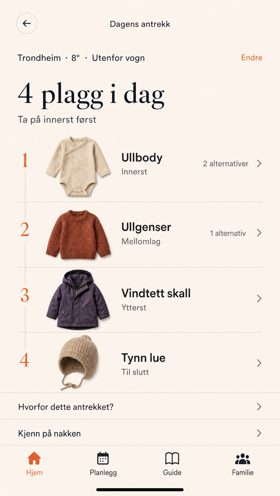
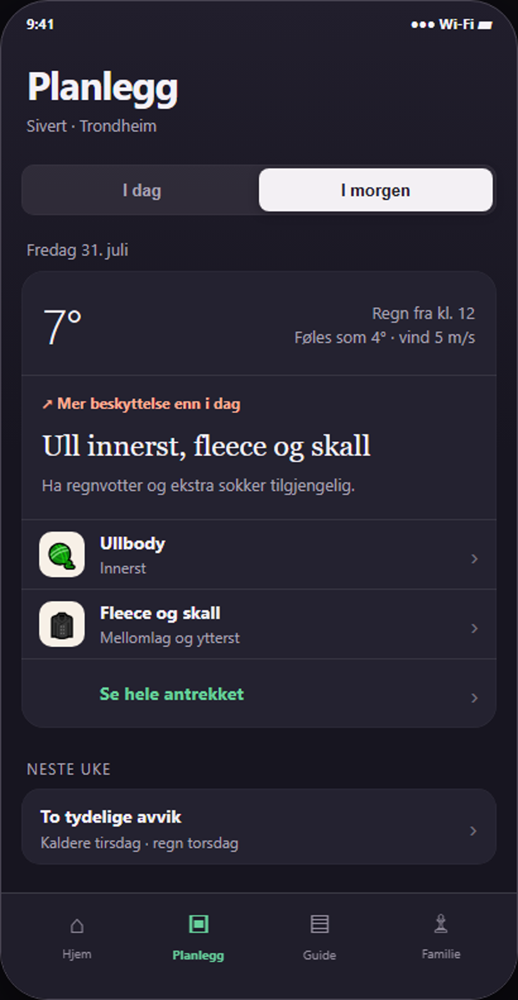
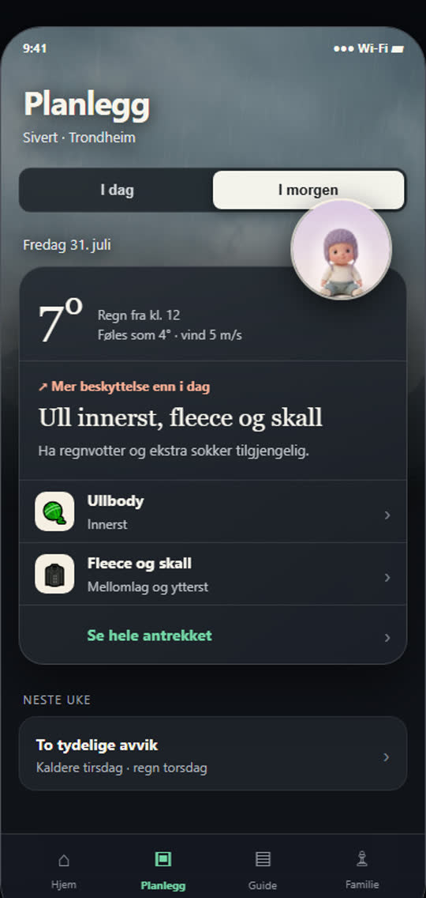
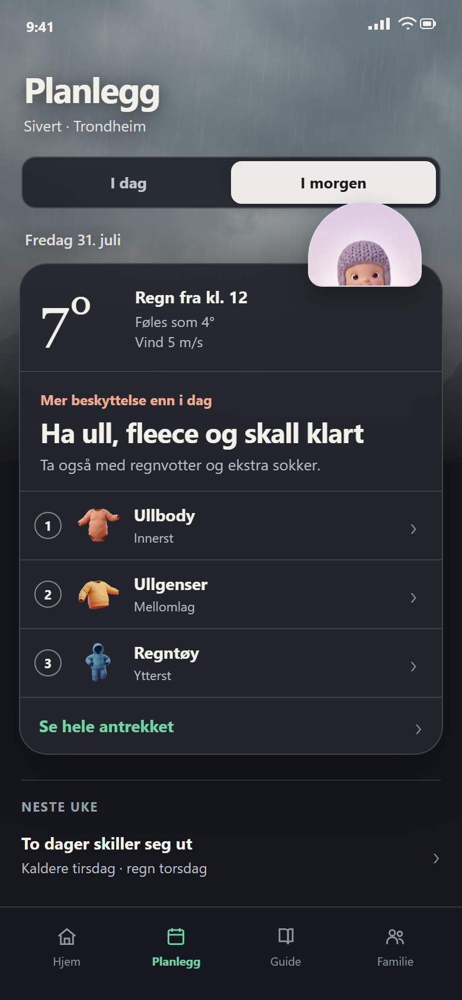

# Babyora design handoff

Date: 2026-07-31  
Audience: Claude Code and Fable 5  
Scope: Hjem, scan-to-result, clothing presentation and Planlegg  
Status: structure approved, final visual system not approved

## Start here

This document is the current source of truth for the design work discussed after the earlier July plans.

Read in this order:

1. This handoff.
2. [`../PRODUCT.md`](../PRODUCT.md)
3. [`../DESIGN.md`](../DESIGN.md)
4. The screenshots embedded below.
5. Existing implementation and older design documents only for technical context.

If an older document conflicts with this handoff, this handoff wins for the surfaces covered here.

## Product direction

Babyora removes the daily uncertainty around dressing a baby for the weather.

The commercial model remains:

- Free: today at one fixed home location.
- Plus: future days, automatic and multiple locations, more children, smart changes and sharing with the family or other caregivers.

The recommendation is the product. Weather, illustration and motion explain and strengthen the recommendation, but must not compete with it.

## Division of responsibility

### Fable 5

Fable 5 owns visual and motion resolution:

- Resolve the final visual language for the approved structures.
- Produce final or production-ready specifications for the hanging mascot.
- Resolve illustrated versus softly photographic weather scenes.
- Propose the final palette and typography system.
- Storyboard the scan and the transition from weather to result.
- Define material, depth, haptic and reduced-motion behavior.
- Produce variants only for decisions marked open in this document.

Fable 5 must not redesign the locked information architecture.

### Claude Code

Claude Code owns implementation and verification:

- Map the approved states to the existing React and Capacitor architecture.
- Reuse the existing recommendation engine and weather integration.
- Implement an explicit state model for weather, scan, cached result and recalculation.
- Build reusable native-feeling components rather than screenshot-specific markup.
- Preserve iOS safe areas, Dynamic Type, 44-point targets and reduced motion.
- Add loading, error, offline and missing-asset fallbacks.
- Add component and end-to-end tests.
- Verify on narrow and tall iPhone layouts before release.

Claude Code must not silently substitute old dressed-avatar logic or the old flat Planlegg design.

## Locked decisions

### 1. Hjem is a two-state experience

For the user, the weather scene transforms into the clothing result.

It may be implemented as two technical views, but it should feel like one continuous experience:

1. Weather scene.
2. Scan.
3. Clothing result.
4. Back returns to the weather state.

### 2. Neutral mascot

The mascot does not attempt to wear every recommended clothing combination.

On the weather surface:

- The baby hangs over the weather or result panel.
- Only the head, arms and a little upper body are visible.
- The pose should feel alive and affectionate without becoming childish entertainment.
- A transparent production asset is required.

Standing and sitting variants can be used elsewhere, such as onboarding, Guide and empty states.

### 3. Scan behavior

- The full scan may play the first time the recommendation is calculated that day.
- Later openings show the cached result immediately.
- A clear recalculate action appears when place or activity changes.
- The scan can show place, weather and activity being evaluated.
- Motion communicates calculation. It is not a fake AI spectacle.
- No permanent background animation is required.
- Reduced-motion mode must replace choreography with an immediate state transition.

Recommended implementation state model:

```text
weather-ready
    -> scanning
    -> result-current

result-current + unchanged inputs
    -> result-current

result-current + changed place/activity/weather basis
    -> result-stale
    -> recalculate
    -> scanning
    -> result-current
```

Cache identity should include at least child, date, place, activity and recommendation-engine version.

### 4. Clothing presentation

Clothes are primary on the result screen.

Use a numbered vertical list in dressing order:

1. Garment image.
2. Garment name.
3. Role, such as `Innerst`, `Mellomlag`, `Ytterst` or `Tilbehør`.
4. Access to alternatives.

The whole row is tappable. Do not rely on a small text-only alternatives button.

The user-facing term is `plagg`. The engine may retain internal layer semantics.

### 5. Planlegg purpose

Planlegg is primarily for practical preparation, not detailed long-range clothing forecasts.

Use two explicit segments:

- `I dag`
- `I morgen`

`I morgen` always presents one preparation widget.

`I dag` presents only meaningful changes in clothing requirements later that day. A meaningful change is a different clothing action, protection requirement or accessory, not merely a temperature change.

The next-week area is compact. It highlights days that differ materially rather than repeating full daily recommendations.

### 6. Weather scenes

Dynamic weather scenes are approved for:

- Hjem.
- The selected-day hero in Planlegg.

Rules:

- The scene explains the recommendation.
- It stays quieter than the answer.
- It fades into a stable reading surface.
- It preserves contrast in every weather state.
- It must not imitate a conventional weather dashboard.
- No decorative particles or constant cinematic movement.
- Guide, Family and detailed garment views stay calmer and more neutral.

### 7. Native interaction

- Familiar segmented controls, navigation and row affordances.
- Minimum 44 by 44 point interactive targets.
- One primary action per state.
- No nested cards.
- One elevated result material is enough.
- Normal UI transitions should usually finish in 150 to 250 ms.
- Touch feedback and haptics must communicate state, not decorate every tap.

## Current visual references

The screenshots are concept references, not pixel-perfect production specifications.

### A. Weather state before scan


What to preserve:

- Weather and place form the calculation context.
- The screen has a clear primary action.
- The mascot creates life without representing the outfit.

What is not final:

- Palette.
- Typography.
- Exact scene composition.
- Exact mascot treatment.

### B. Scan state


What to preserve:

- Place, weather and activity visibly participate in the calculation.
- The transition should communicate that Babyora is evaluating real inputs.

What is not final:

- Duration.
- Copy.
- Scan-line treatment.
- Haptic pattern.

Motion reference:

[Open scan motion concept](handoff-assets/2026-07-31/babyora-motor-scan-motion.mp4)

### C. Result state


What to preserve:

- Result follows naturally from the scan.
- Clothing becomes the primary output.
- The user can return to the weather state.

### D. Weather theatre direction


This is a directional reference for atmosphere and product personality.

Preserve:

- Weather as a scene rather than a detached number.
- Strong visual hierarchy.
- A clear relationship between body areas and clothing.

Do not copy literally:

- The dressed avatar.
- The exact palette.
- The amount of visual drama.
- Any need to generate every clothing combination.

### E. Locked clothing-list direction



This locks the information model:

- Numbered order.
- Garment imagery.
- Garment name.
- Dressing role.
- Alternatives from the row.

Colors, shadows, row heights and final typography are still open.

### F. Planlegg baseline that felt too flat



Why it was rejected as the final direction:

- Technically understandable, but emotionally dead.
- Too much flat surface without atmosphere.
- Insufficient Babyora identity.

What remains useful:

- Native control proportions.
- Clear `I dag / I morgen` model.
- Calm secondary information.

### G. Intermediate atmosphere experiment



This established that a restrained weather scene gives Planlegg needed life. It is not the final composition.

### H. Current Planlegg consensus



This is the closest current reference.

Preserve:

- Dynamic, subdued weather scene.
- Explicit day toggle.
- One continuous result surface.
- Mascot overlapping the surface.
- Real garment imagery.
- Clothing answer before secondary forecast information.
- Compact next-week deviations.
- Native bottom navigation.

Improve:

- Replace the temporary cropped mascot with a transparent hanging asset showing arms.
- Resolve the final weather-art family.
- Reduce any remaining desktop-web feeling in material and typography.
- Validate content density on the smallest supported iPhone.

## What is not landed

The following must be resolved by Fable 5 before Claude Code treats them as final:

### Visual system

- Final palette.
- Light, dark or adaptive theme strategy.
- Final semantic color tokens.
- Final typography families and scale.
- Exact corner radii, elevation and divider treatment.
- Final icon family.

### Art direction

- Illustrated versus softly photographic weather scenes.
- Complete weather-scene family and transition rules.
- Transparent hanging mascot asset.
- Standing and sitting mascot variants.
- Final garment-image production quality and consistency.

### Motion and haptics

- Exact scan duration and choreography.
- Shared-element transition between weather and result.
- Recalculation animation.
- Haptic vocabulary.
- Whether sound is used at all.

### Detailed interaction

- Exact position and wording of `Beregn på nytt`.
- Whether the first scan can be skipped manually.
- Exact error and offline behavior.
- Exact expansion behavior for `Neste uke`.
- Exact amount of clothing detail shown in the tomorrow widget.

### Broader screens

- Final application of the new system to Guide, Family, onboarding and paywall.
- Final logo and wordmark integration within the new palette.
- Final Plus visual language.

## Explicitly rejected directions

- Generating a separately dressed mascot for every possible clothing combination.
- Requiring users to photograph or maintain a complete wardrobe.
- Image analysis of the dressed child as a source of safety-critical advice.
- A detailed forecast table for every hour and every future day.
- Treating all temperature changes as clothing changes.
- Using daycare-specific language as the universal planning model.
- Emoji as production garment or navigation imagery.
- Continuous decorative motion.
- Generic glassmorphism across the entire app.
- Returning to the old flat Planlegg screen as the finished visual direction.

## Existing reusable assets

Weather candidates:

```text
public/weather-bgs/
public/weather-3d/
```

Garment candidates:

```text
public/illustrations/garments-clay/
public/plagg-katalog.json
```

Mascot and onboarding candidates:

```text
public/illustrations/onboarding/
public/avatars/
```

These are useful for implementation prototypes. Fable 5 must decide which are production-quality.

## Implementation sequence

### Phase 1: Resolve the open visual contract

Fable 5 delivers:

1. Hjem weather-ready state.
2. Hjem scan state.
3. Hjem result state.
4. Planlegg `I dag`.
5. Planlegg `I morgen`.
6. Hanging mascot asset specification.
7. Weather-scene family.
8. Motion and reduced-motion storyboard.
9. Palette and typography proposal.

The five screens must use the same component and material vocabulary.

### Phase 2: Architecture and component implementation

Claude Code:

1. Maps existing components and engine data to the new states.
2. Defines the scan/cache state machine.
3. Creates reusable weather-scene, mascot-peek, segmented-control, result-surface and garment-row components.
4. Implements behind a reversible feature flag where practical.
5. Keeps recommendation logic separate from presentation.

### Phase 3: Verification

Claude Code verifies:

- Cached and first-scan behavior.
- Location and activity invalidation.
- Offline and weather-error fallback.
- Missing garment and mascot assets.
- Reduced motion.
- Dynamic Type and long Norwegian strings.
- Small and large iPhone layouts.
- VoiceOver labels and focus order.
- No regressions in the recommendation engine.

### Phase 4: Product review

Review the implemented build on a real iPhone before applying the system to the rest of the app.

Do not use generated marketing screenshots as implementation evidence.

## Acceptance criteria

The handoff is implemented correctly when:

- A parent understands the selected day and main clothing action within a few seconds.
- The weather scene gives context without behaving like a weather app.
- The mascot adds warmth but never claims to show the exact outfit.
- The full daily scan is not repeated unnecessarily.
- Changing location or activity offers a clear recalculation.
- Clothing order and alternatives are obvious.
- Planlegg answers tomorrow first and later-today changes second.
- Next week highlights only material deviations.
- The interface remains readable across every weather background.
- Motion has a reduced-motion equivalent.
- The result works if images fail to load.

## Final instruction to both agents

Preserve the locked product structure. Be ambitious inside the open visual decisions.

Do not optimize the screenshot. Optimize the repeated daily experience of a tired parent holding a phone with one hand.
