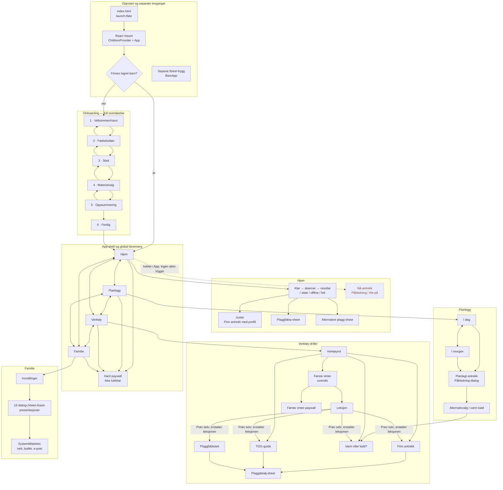

# Nåværende appflyt

**Analyse-dato:** 2026-08-09

**Analysert commit:** `2dce070038a659486491a521854ce5d820fac79c`

**Omfang:** Hovedappen, onboarding, alle fire faner, alle aktive drill-visninger, app-eide dialoger/sheets/presentasjoner, systemoverganger, deklarerte dyplenker og den separate `/bare/`-bygget.

## Dekning og tellemetode

- **19 sider/visningstilstander** er listet i sidetabellen. Onboardingens seks steg telles separat fordi de har egne inngangs-, validerings- og tilbake-regler.
- **27 app-eide overlay-/dialog-/sheet-presentasjoner** er listet i overlaytabellen. Like komponenter med forskjellig eier eller gate telles som egne presentasjoner.
- Systemtillatelser, `window.confirm` og eksterne nett-/butikkoverganger er dokumentert separat og inngår ikke i de 27.
- Alle **12 eksporterte `*Screen`-komponenter** er mappet eller forklart i skjermdekningsmatrisen.
- Appen bruker en lokal React-state-ruter i `src/App.tsx:223-258,369-440,721-809`. Den bruker ikke React Router, URL-stier eller nettleserhistorikk for intern navigasjon.

## Flytkart

Kildene for ruterskallet er `src/main.tsx:17-63`, `src/App.tsx:223-258,369-440,711-719,721-809,862-913` og `src/types/nav.ts:10-40`.

## Sider og visningstilstander

| # | Side/visning | Inngang | Utgang | Vilkår og faktisk atferd | Kilder |
|---:|---|---|---|---|---|
| 1 | Launch-flate | Lasting av hoveddokumentet | Fjernes to animation frames etter App-commit; 4 s nødfrist | `?launch-preview` holder launch-flaten synlig for forhåndsvisning. Vanlig lasting går videre til barnesjekken. | `index.html:17-38,273-303`; `src/lib/launch-handoff.ts:34-100`; `src/main.tsx:25-63`; `src/App.tsx:284-291` |
| 2 | Onboarding 1 — velkommen/navn | Barnesjekk finner tom barneliste | Neste til steg 2 | Navn beskrives som valgfritt og CTA er alltid aktiv, men steg 5 krever et ikke-tomt navn. Ingen tilbakeknapp. | `src/state/children-provider.tsx:25-50`; `src/screens/OnboardingScreen.tsx:236-291,488-529,900-916` |
| 3 | Onboarding 2 — fødselsdato | Neste fra steg 1 | Tilbake til 1 eller neste til 3 | Gyldig fødselsdato kreves for neste. Escape går tilbake. | `src/screens/OnboardingScreen.tsx:236-317,456-465,917-928` |
| 4 | Onboarding 3 — sted | Neste fra steg 2 | Tilbake til 2 eller neste til 4 | Krever bekreftet GPS- eller manuelt valgt sted. GPS kan åpne systemets posisjonstillatelse. | `src/screens/OnboardingScreen.tsx:319-430,456-465,929-940` |
| 5 | Onboarding 4 — materialvalg | Neste fra steg 3 | Tilbake til 3 eller neste til 5 | Ingen ekstra validering; valget inngår i barnedata. | `src/screens/OnboardingScreen.tsx:236-317,456-465,941-952` |
| 6 | Onboarding 5 — oppsummering | Neste fra steg 4 | Tilbake til 4 eller lagre barn og gå til steg 6 | Krever navn, fødselsdato og sted. CTA kan derfor bli blokkert etter at steg 1 tillot blankt navn. | `src/screens/OnboardingScreen.tsx:432-446,456-465,953-966` |
| 7 | Onboarding 6 — ferdig | Vellykket lagring på steg 5 | «Gå til Babyora» åpner Hjem | Ingen tilbakeknapp. `onComplete` setter den lokale shell-gaten til åpen. | `src/screens/OnboardingScreen.tsx:448-454,967-974`; `src/App.tsx:711-719` |
| 8 | Hjem | Standardfane etter oppstart/onboarding; Hjem-fanen | Andre faner; «Juster» til Finn antrekk; fakta/alternativer | Aktiv implementasjon er `HjemMonter`. Den viser klar, skanning, resultat, utdatert, offline eller feil. «Vis forrige antrekk» i utdatert tilstand er dokumentert no-op. | `src/components/hjem/flags.ts:1-13`; `src/screens/HjemScreen.tsx:510-521,643-651,1035-1064`; `src/components/hjem/HjemMonter.tsx:742-753,807-1110` |
| 9 | Planlegg — I dag | Planlegg-fanen; standard intern segment | «I morgen», planlagt antrekk eller annen fane | Full planvisning er gratis. Hendelser kan åpne planlagt antrekk når kontekst og tilgang er gyldige. | `src/screens/UkeScreen.tsx:320-391,680-708,855-937,947-1112`; `src/lib/premium/gating.ts:60-99` |
| 10 | Planlegg — I morgen | Segmentknapp fra I dag | I dag, planlagt antrekk eller annen fane | Segmentet kan velges, men rådene er bare synlige når fremtidstilgang og implementasjonsflagget tillater det. Ved nekt skjules innholdet uten lokal forklaring/paywall. | `src/screens/UkeScreen.tsx:320-391,710-785,855-1112`; `src/lib/premium/gating.ts:60-99` |
| 11 | Verktøyrot | Verktøy-fanen | En av fire verktøydriller eller annen fane | Viser Finn antrekk, TOG-guide, Første vinter og Varm eller kald. | `src/screens/VerktoyScreen.tsx:7-37,80-137`; `src/App.tsx:801-803` |
| 12 | Finn antrekk | Kort på Verktøy; «Juster» på Hjem; Første vinter-oppgave | Tilbake til underliggende rotfane; plaggdetalj-sheet | Hjem-inngangen gir vær-prefill. Bruker velger temperatur, vind, nedbør og aktivitet; resultat oppstår først etter beregning og blir «utdatert» ved etterfølgende endring. | `src/App.tsx:389-434,751-761`; `src/screens/FinnAntrekkScreen.tsx:446-459,706-708,760-1103` |
| 13 | TOG-guide | Kort på Verktøy; Første vinter-oppgave | Tilbake til Verktøy; plaggdetalj-sheet | Temperatur-slider og presets driver anbefalte plagg. | `src/App.tsx:762-764`; `src/screens/TogGuideScreen.tsx:200-300,956-1230` |
| 14 | Varm eller kald? | Kort på Verktøy; Første vinter-oppgave; recovery fra planlagt antrekk | «Tilbake» eller «Ferdig» til underliggende rotfane | Informasjonsside; statusradene er med vilje ikke interaktive. Når åpnet fra planlagt antrekk erstatter den dialog-drillen, så tilbake går til Planlegg-roten. | `src/App.tsx:402-405,765-767,881-882`; `src/screens/VarmEllerKaldScreen.tsx:129-148,637-650,877-889` |
| 15 | Første vinter — oversikt | Kort på Verktøy | Tilbake til Verktøy; leksjon; paywall | Åtte uker. Uke 1 er gratis; uke 2–8 krever Plus. Tilgjengelige leksjoner kan åpnes uten tidsbasert progresjonslås. | `src/App.tsx:768-775`; `src/screens/VinterprogramScreen.tsx:76-171,175-307` |
| 16 | Første vinter — leksjon | Valg av ulåst uke i oversikten | Tilbake til oversikt; «Prøv selv» erstatter hele drillen | Oppgavemål er bibliotek i uke 1/8, Finn antrekk i uke 2/3/4/7, Varm eller kald i uke 5 og TOG i uke 6. Tilbake fra mål går til Verktøy-roten, ikke leksjonen. | `src/screens/VinterprogramScreen.tsx:175-307`; `src/data/vinterprogram.ts:45-249`; `src/App.tsx:386-400` |
| 17 | Plaggbibliotek | Første vinter-oppgave i uke 1 eller 8; intern `drill='plaggbib'` | Tilbake til underliggende rotfane; plaggdetalj-sheet | Søk, filter og sortering virker. Synlig «Legg til plagg»-FAB kaller en valgfri callback som App ikke leverer, og gjør derfor ingenting. Aktiv Hjem-flate har ingen fungerende bibliotek-trigger. | `src/App.tsx:395-397,421-424,756-758`; `src/screens/PlaggbibliotekScreen.tsx:530-629,910-920` |
| 18 | Familie / Innstillinger | Familie-fanen | Dialoger/sheets, systemhandlinger eller annen fane | `FamilieScreen` er kun wrapper rundt `InnstillingerScreen`. Profilredigering og posisjonsraden har no-op-klikk; øvrige innstillinger og lokale barnedata håndteres her. | `src/screens/FamilieScreen.tsx:8-16`; `src/screens/InnstillingerScreen.tsx:1283-1329,2048-2656` |
| 19 | BareApp på `/bare/` | Egen Vite-entry: `npm run dev:bare` eller bygget `/bare/` | Samme side; plagglenker er bare hash-ankre | Ikke en rute i hovedappen. Viser Elverum-vær, aktivitet, alder, anbefaling og rå JSON uten appens design-/navigasjonsskall. | `package.json:8,11-12`; `apps/bare/vite.config.ts:5-23`; `apps/bare/main.tsx:1-12`; `apps/bare/BareApp.tsx:29-170` |

## App-eide overlays, dialoger, sheets og presentasjoner

| # | Presentasjon | Åpnes fra | Lukkes/fortsetter via | Vilkår og merknad | Kilder |
|---:|---|---|---|---|---|
| 1 | Hjem: skanne-/beregningsflate | «Finn antrekk» på Hjem | Automatisk til resultat; «Hopp over» | Egen fullflate over Hjem-innholdet mens anbefaling bygges. | `src/components/hjem/HjemMonter.tsx:807-860` |
| 2 | Hjem: plaggfakta-sheet | Info på et plagg i resultatkarusellen | X, Escape eller backdrop | Generisk modal sheet; kan åpne ekstern faktakilde. | `src/components/hjem/ResultSurface.tsx:91-137,255-307,344-491`; `src/components/hjem/GarmentFactSheet.tsx:27-73`; `src/components/controls/Sheet.tsx:50-135` |
| 3 | Hjem: alternative plagg-sheet | «Bytt» på et resultatplagg | X, Escape eller backdrop | Informativ liste uten velg-/bruk-handling. | `src/components/hjem/HjemMonter.tsx:922-927`; `src/components/hjem/GarmentAlternativesSheet.tsx:91-256` |
| 4 | Finn antrekk: skanne-/beregningsflate | Beregn-CTA | Automatisk til resultat; «Hopp over» | Resultatet opprettes først etter denne sekvensen. | `src/screens/FinnAntrekkScreen.tsx:760-789` |
| 5 | Delt plaggdetalj-sheet | Plaggrad i Finn antrekk, TOG eller bibliotek | X, Escape eller backdrop | Samme detaljflate brukes av tre drill-sider. | `src/screens/FinnAntrekkScreen.tsx:791-1103`; `src/screens/TogGuideScreen.tsx:956-1230`; `src/screens/PlaggbibliotekScreen.tsx:910-920` |
| 6 | Hard global paywall | Første Hjem-anbefaling er sett; eller Planlegg konsumerer sesjonsfristen | Kjøp/gjenopprett; ingen vanlig lukk | Ikke avvisbar: Escape og backdrop blokkeres. Vises når onboarding er ferdig, anbefaling er sett, frist er inaktiv, Plus mangler og tilgang er ferdig lastet. | `src/components/AppPaywallGate.tsx:52-120`; `src/App.tsx:362-379,816-820`; `src/components/PaywallDialog.tsx:747-803,847-905` |
| 7 | Første vinter-paywall | Trykk på uke 2–8 uten Plus | X, Escape, backdrop, kjøp/gjenopprett | Feature-gate med trigger for vinterprogrammet. | `src/screens/VinterprogramScreen.tsx:76-171`; `src/components/PaywallDialog.tsx:704-803,916-991` |
| 8 | Påkledning-dialog, planlagt eller nå-antrekk fallback | Planhendelse; internt koblet nå-antrekk-callback | Tilbake/X/Escape; varm-kald recovery | Planlagt kontekst krever gyldig kontekst, tilkoblet origin og fremtidstilgang. Nå-antrekk-fallback er koblet i App, men har ingen aktiv Hjem-trigger. | `src/App.tsx:442-523,525-540,872-903`; `src/screens/PaakledningScreen.tsx:120-405,422-441` |
| 9 | Kle på, steg for steg-dialog | Nå-antrekk med støttet outfit-bundle | X, Escape, sveip, Forrige/Neste, Ferdig | Én plaggvisning per steg. Koblet i App, men den aktive Hjem-flaten åpner ikke nå-antrekket. | `src/App.tsx:883-890`; `src/components/klepaa/kle-paa-rute.ts:31-49`; `src/components/klepaa/KlePaaOverlay.tsx:54-175`; `src/components/klepaa/KlePaaStepper.tsx:236-480` |
| 10 | Antrekkssammenligning | «Se alternativer» i Påkledning eller Kle på | Avbryt, velg eller Escape | Rendres som `<dialog open>`, ikke `showModal()`; har ingen egen backdrop-lukking. I Kle på lukker første Escape sammenligningen før ytre dialog. | `src/components/outfit/OutfitExperience.tsx:82-143,146-260`; `src/components/klepaa/KlePaaOverlay.tsx:54-175` |
| 11 | Antrekksovergang | Navigasjon fra nå-antrekk med snapshot | Automatisk ferdig eller abort | Visuell, ikke-klikkbar overlay; fullføres automatisk og avbrytes ved redusert bevegelse/ugyldig tilstand. | `src/App.tsx:488-503,906-913`; `src/components/outfit-transition/OutfitTransitionOverlay.tsx:127-230` |
| 12 | Familie: tidspunkt for morgenvarsel | Morgenvarsel-rad | Velg tidspunkt, X, Escape eller backdrop | Native dialog med fokusretur. | `src/screens/InnstillingerScreen.tsx:1792-1877,2667-2678` |
| 13 | Familie: hjelp | Hjelp-rad | X, Escape eller backdrop | Native dialog med fokusretur. | `src/screens/InnstillingerScreen.tsx:2497-2656,2680-2686` |
| 14 | Familie: tilbakemelding | Tilbakemelding-rad | X, Escape, backdrop eller åpne e-post | E-post er en ekstern systemovergang. | `src/screens/InnstillingerScreen.tsx:1510-1636,2688-2695` |
| 15 | Familie: personvern | Personvern-rad | X, Escape, backdrop eller ekstern lenke | Åpner personvernressurs utenfor appen. | `src/screens/InnstillingerScreen.tsx:1510-1636,2697-2704` |
| 16 | Familie: slett data | «Slett mine data» | Avbryt/X/Escape/backdrop eller bekreft | Bekreft tømming av lokale data og barneliste. | `src/screens/InnstillingerScreen.tsx:1510-1636,2706-2715` |
| 17 | Familie: generell Plus-paywall | Abonnementsraden | X, Escape, backdrop, kjøp/gjenopprett | Har `trigger=null` og fokusretur til abonnementsraden. | `src/screens/InnstillingerScreen.tsx:1672-1690,2459-2494,2717-2725` |
| 18 | Familie: bytt barn | «Bytt barn» | Velg barn, X, Escape eller backdrop | Deaktivert ved færre enn to barn. Barn nummer 2+ starter en egen paywall uten Plus. | `src/screens/InnstillingerScreen.tsx:1368-1508,2048-2135,2727-2738` |
| 19 | Familie: barn 2+-paywall | Valg av barn nummer 2+ uten Plus | X, Escape, backdrop, kjøp/gjenopprett | Legges over bytt-barn-dialogen, som forblir åpen. | `src/screens/InnstillingerScreen.tsx:2740-2748` |
| 20 | Familie: legg til barn | «Legg til barn» | Lagre, X, Escape eller backdrop | Selve opprettelsen er ikke Plus-gated og gjør ikke automatisk det nye barnet aktivt. | `src/state/children-provider.tsx:56-59`; `src/screens/InnstillingerScreen.tsx:2048-2135,2750-2757` |
| 21 | Familie: materialpreferanse-sheet | Materialpreferanse-rad | Valg, X, Escape eller backdrop | Oppdaterer aktivt barns preferanse når onboarding ikke kreves. | `src/screens/InnstillingerScreen.tsx:2048-2135,2759-2770` |
| 22 | Familie: automatisk posisjon | Slå på automatisk posisjon | Avbryt/X/Escape/backdrop eller fortsett til systemprompt | Appforklaring vises før `navigator.geolocation`. | `src/screens/InnstillingerScreen.tsx:1692-1790,2772-2790` |
| 23 | Familie: varsel ved værendring | Slå på værendringsvarsel | Avbryt/X/Escape/backdrop eller fortsett til systemprompt | Appforklaring vises før varslingstillatelse. | `src/screens/InnstillingerScreen.tsx:1792-1877,2792-2804` |
| 24 | Familie: værkilde | Værkilde-rad | X, Escape, backdrop eller åpne met.no | Informasjon om Meteorologisk institutt. | `src/screens/InnstillingerScreen.tsx:2164-2276,2806-2817` |
| 25 | Familie: vurder appen | «Vurder appen» | Avbryt/X/Escape/backdrop eller fortsett til system/store | Appforklaring vises før StoreKit/Play Review. | `src/screens/InnstillingerScreen.tsx:1510-1636,2819-2831` |
| 26 | Familie: referansetime | Referansetime-rad | Velg 6/9/12/15/18/21, X, Escape eller backdrop | Valget lagres lokalt og fokus returneres til raden. | `src/screens/InnstillingerScreen.tsx:1879-1952,2164-2276,2833-2844` |
| 27 | Familie: status-toast | Tillatelses-/fallback-resultat | Forsvinner etter intern timer | `role="status"` og `aria-live="polite"`; ikke interaktiv. | `src/screens/InnstillingerScreen.tsx:2846-2873` |

## System-, nett- og native-overganger

| Overgang | Utløser | Retur/utfall | Kilder |
|---|---|---|---|
| Posisjonstillatelse i onboarding | GPS-valg på steg 3 | Resultat brukes i stedsteget; manuell stedvelger er alternativ | `src/screens/OnboardingScreen.tsx:319-430` |
| Posisjonstillatelse i Familie | Bekreft i automatisk-posisjon-dialog | Oppdaterer lokasjon eller viser fallback-toast | `src/screens/InnstillingerScreen.tsx:1692-1790,2772-2790` |
| Varslingstillatelse | Morgenvarsel kan spørre direkte; værendring spør etter appdialog | Oppdaterer toggle eller viser fallback-toast | `src/screens/InnstillingerScreen.tsx:1792-1877,2792-2804` |
| App Store / Play Store / systemvurdering | Bekreft «Vurder appen» | Ekstern native handling; fokus/tilstand beholdes ved retur | `src/screens/InnstillingerScreen.tsx:1510-1636,2819-2831` |
| Nett, juridisk innhold og e-post | Fakta, værkilde, personvern, paywall-juss, tilbakemelding | Forlater appkontekst til nettleser eller e-postklient | `src/components/hjem/GarmentFactSheet.tsx:27-73`; `src/components/PaywallDialog.tsx:1140-1171`; `src/screens/InnstillingerScreen.tsx:1510-1636,2688-2704,2806-2817` |
| Logg ut-bekreftelse | «Logg ut» i Familie | `window.confirm`; ved bekreftelse nullstilles lokale barnedata | `src/screens/InnstillingerScreen.tsx:1954-1960,2497-2656`; `src/state/children-provider.tsx:88-98` |

## Tilbake-, lukk- og erstatningsregler

| Situasjon | Faktisk regel | Kilder |
|---|---|---|
| Onboarding | Steg 2–5 har tilbakeknapp og Escape-tilbake. Steg 1 og 6 har ingen tilbakevei. | `src/screens/OnboardingScreen.tsx:293-317,456-465,488-496` |
| Vanlig drill | Tilbake setter `drill=null` og viser den lagrede rotfanen. Venstre kant-sveip gjør det samme. | `src/App.tsx:381-384,541-670` |
| Rotfane og kant-sveip | På en ikke-Hjem-rot går kant-sveip til Hjem. På Hjem uten drill finnes ingen intern bakovertilstand. | `src/App.tsx:541-670` |
| Fanetrykk under drill | Trykk på en annen fane lukker drillen og bytter fane. Aktivt markert fane er no-op i `BottomTabBar`, så den kan ikke brukes som «tilbake». | `src/App.tsx:369-379,724-739`; `src/components/BottomTabBar.tsx:21-35,132-157` |
| Første vinter-oppgave | «Prøv selv» erstatter leksjonsdrillen. Tilbake fra målet går til Verktøy-roten, ikke tilbake til leksjonen. | `src/App.tsx:386-400`; `src/screens/VinterprogramScreen.tsx:175-307` |
| Planlagt antrekk → varm/kald | Recovery erstatter Påkledning-dialogen med Varm eller kald. Tilbake går til Planlegg-roten. | `src/App.tsx:402-405,872-903` |
| Påkledning/Kle på | Native modal skjuler global fanemeny. X/Escape/Ferdig lukker og forsøker å returnere fokus til origin. | `src/App.tsx:507-523,741-749,862-904`; `src/components/klepaa/KlePaaOverlay.tsx:54-175` |
| Sheets og Familie-dialoger | X, Escape og backdrop lukker, med fokusretur. Sammenligningsdialogen er unntaket uten backdrop-regel. | `src/components/controls/Sheet.tsx:50-135`; `src/screens/InnstillingerScreen.tsx:2667-2844`; `src/components/outfit/OutfitExperience.tsx:82-143` |
| Hard paywall | Escape, backdrop og vanlig lukk blokkeres. Bare vellykket tilgangsendring fjerner gaten. | `src/components/AppPaywallGate.tsx:76-120`; `src/components/PaywallDialog.tsx:747-803,898-905` |
| Android system-tilbake | Bruker nettleserhistorikk hvis WebView kan gå tilbake, ellers minimeres appen. Appens manuelle state-ruter legger ikke drill/faner i history. | `src/lib/native-init.ts:55-93`; `src/App.tsx:223-258,369-440` |

## Betingelser for tilgang, data og «innlogging»

| Område | Faktisk betingelse | Kilder |
|---|---|---|
| Global Plus-gate | Gjelder etter første anbefaling når sesjonsfristen er brukt og Plus mangler. Åpning av Planlegg konsumerer fristen. | `src/components/AppPaywallGate.tsx:52-120`; `src/App.tsx:362-379` |
| Planlagt antrekk | Krever gyldig `PlannedOutfitContext`, tilkoblet origin og tillatt `future_plan`. Åpen planlagt dialog lukkes automatisk hvis tilgang forsvinner. | `src/App.tsx:442-471,525-540` |
| Kjøp/gjenopprett | Native bruker RevenueCat. Web/dev bruker lokal simulering; web-gjenoppretting returnerer feil. Ingen plan er forhåndsvalgt. | `src/components/PaywallDialog.tsx:704-736,916-991`; `src/lib/premium/use-access.ts:153-217,226-234` |
| Demo-query | Enhver tilstedeværende `?seed` aktiverer demo-barn. Demo gir Plus med mindre `entitlement=none`. | `src/state/children-store.tsx:117-120`; `src/state/subscription-store.ts:56-65` |
| Autentisering | Ingen aktiv authflyt. Tilgangskontekster bruker `authenticated: false`; familie-/omsorgsdeling er en dev-preview uten auth, RLS eller backend. «Logg ut» nullstiller kun lokale data. | `src/screens/InnstillingerScreen.tsx:1272-1274,2140-2161,1954-1960`; `src/state/children-provider.tsx:88-98` |

## Døde, uklare eller ubrukte ruter og handlinger

| Funn | Konsekvens | Kilder |
|---|---|---|
| Aktiv Hjem er låst til `HjemMonter`, men `HjemMonter` tar ikke imot nå-antrekk-callbacken. | Påkledning/Kle på for nå-antrekk og overgangsoverlayen er ferdig koblet i `App`, men kan ikke åpnes fra den synlige produksjonsflaten. | `src/components/hjem/flags.ts:1-13`; `src/screens/HjemScreen.tsx:1035-1064`; `src/components/hjem/HjemMonter.tsx:224-281`; `src/App.tsx:488-503,872-913` |
| `onOpenWarmColdGuide` og `onOpenPlaggbib` sendes til `HjemScreen`/`HjemMonter`, men utelates i `HjemMonter`-destruktureringen. | Aktiv Hjem kan ikke åpne Varm eller kald eller biblioteket direkte. | `src/App.tsx:779-790`; `src/components/hjem/HjemMonter.tsx:224-281` |
| Kommentarene i `App.tsx` beskriver PlaggDetailSheet → bibliotek, men Hjems aktive «Bytt»-flate er bare informativ. | Den kommenterte Hjem→bibliotek-ruten finnes ikke i synlig UI. Biblioteket nås via Første vinter. | `src/App.tsx:407-424`; `src/components/hjem/GarmentAlternativesSheet.tsx:91-256` |
| Bibliotekets «Legg til plagg» kaller valgfri `onOpenCategory`, men App mounter skjermen uten callback. | Den synlige FAB-en har ingen effekt. | `src/App.tsx:756-758`; `src/screens/PlaggbibliotekScreen.tsx:530-629` |
| Bibliotek-drillen markeres som Hjem i fanemenyen selv når den kom fra en leksjon under Verktøy. | Hjem fremstår aktiv bak biblioteket; lukk returnerer likevel til lagret Verktøy-rot. | `src/App.tsx:724-739`; `src/screens/VinterprogramScreen.tsx:175-307` |
| Planlegg «I morgen» skjuler nyttig innhold ved nekt uten lokal forklaring eller CTA. | I anbefalingsfristen kan segmentet åpnes som en nesten tom visning før den globale gaten blir due. | `src/screens/UkeScreen.tsx:710-785,855-1112`; `src/lib/premium/gating.ts:60-99` |
| Onboarding steg 1 sier valgfritt navn og tillater neste, mens steg 5 krever navn. | Brukeren kan nå en blokkert oppsummering uten forklaring på det tidligere steget. | `src/screens/OnboardingScreen.tsx:900-916,953-966` |
| `onboardingDone` leses fra `needsOnboarding` én gang og oppdateres bare til `true`. | Slett data/logg ut tømmer barnelisten, men viser ikke onboarding i samme App-økt; reload gjør det. | `src/App.tsx:293-303,711-719`; `src/state/children-provider.tsx:25-50,88-98`; `src/screens/InnstillingerScreen.tsx:1624-1636,1954-1960` |
| Profilens redigeringsknapp og posisjonsraden i Familie har no-op-handlere. | Synlige rader ser navigerbare ut, men åpner ingen side eller dialog. | `src/screens/InnstillingerScreen.tsx:2057-2059,2164-2173` |
| Aktivt markert fanetrykk er no-op. | Under en drill kan den markerte fanen ikke brukes til å lukke drillen, selv om et annet fanetrykk kan det. | `src/components/BottomTabBar.tsx:21-35,132-157`; `src/App.tsx:369-379` |
| Appens `onNavigate` ignoreres lokalt av Hjem og Uke; Uke ignorerer også `onOpenSheet`. | Disse propene gir inntrykk av interne utganger som ikke finnes. | `src/screens/HjemScreen.tsx:371-384`; `src/screens/UkeScreen.tsx:1117-1126` |
| Dokumenttittelen følger bare rotfanen, ikke aktiv drill. | Finn, TOG, bibliotek og Første vinter arver tittelen til den underliggende/mappede fanen. | `src/App.tsx:358-360,721-739` |
| Android/iOS deklarerer `babyora://` og widgeten lager `babyora://hjem` og `babyora://brief/<id>`, men runtime har ingen URL-parser/listener. | Kald `hjem` ser bare riktig ut fordi standardfanen er Hjem; `brief` ignoreres, og varme dyplenker ruter ikke. | `android/app/src/main/AndroidManifest.xml:21-28`; `ios/App/App/Info.plist:23-31`; `src/lib/widget/snapshot.ts:120-151`; `src/lib/native-init.ts:55-93` |
| `ToolsSection` finnes, men importeres eller rendres ikke av aktiv Familie. | Komponenten er uåpnet/ubrukt i produksjonsflyten. | `src/components/family/ToolsSection.tsx:21-132`; `src/screens/FamilieScreen.tsx:8-16` |
| `GuideHubScreen` finnes ikke; måltypen har fem aktive verdier selv om kommentaren sier seks. | Guide-mål rutes direkte til driller; ingen guide-hub-side skal forventes. | `src/App.tsx:239-247,386-400`; `src/types/nav.ts:31-40` |
| Hjems «Vis forrige antrekk» er eksplisitt no-op i utdatert tilstand. | Knappen endrer ikke resultat eller visning. | `src/components/hjem/HjemMonter.tsx:742-753,932-988` |

## Skjermkomponent-dekning

| Eksportert komponent | Mappet som | Status | Kilder |
|---|---|---|---|
| `OnboardingScreen` | Side 2–7 | Aktiv, full overtakelse før shell | `src/screens/OnboardingScreen.tsx:236-529,900-974`; `src/App.tsx:711-719` |
| `HjemScreen` | Side 8 | Aktiv rotfane; rendrer `HjemMonter` | `src/screens/HjemScreen.tsx:1035-1064`; `src/App.tsx:776-790` |
| `UkeScreen` | Side 9–10 | Aktiv Planlegg-rot med to interne segmenter | `src/screens/UkeScreen.tsx:320-391,855-1126`; `src/App.tsx:792-800` |
| `VerktoyScreen` | Side 11 | Aktiv Verktøy-rot | `src/screens/VerktoyScreen.tsx:7-137`; `src/App.tsx:801-803` |
| `FinnAntrekkScreen` | Side 12 | Aktiv drill fra Hjem, Verktøy og leksjoner | `src/screens/FinnAntrekkScreen.tsx:446-1103`; `src/App.tsx:751-761` |
| `TogGuideScreen` | Side 13 | Aktiv drill fra Verktøy og leksjon | `src/screens/TogGuideScreen.tsx:200-300,956-1230`; `src/App.tsx:762-764` |
| `VarmEllerKaldScreen` | Side 14 | Aktiv drill/recovery | `src/screens/VarmEllerKaldScreen.tsx:129-148,637-650,877-889`; `src/App.tsx:765-767` |
| `VinterprogramScreen` | Side 15–16 | Aktiv Første vinter-drill med intern oversikt/leksjon | `src/screens/VinterprogramScreen.tsx:76-307`; `src/App.tsx:768-775` |
| `PlaggbibliotekScreen` | Side 17 | Aktiv drill via Første vinter; Hjem-callbacken er uforbrukt | `src/screens/PlaggbibliotekScreen.tsx:530-629,910-920`; `src/App.tsx:756-758` |
| `FamilieScreen` | Side 18 | Aktiv rotfane og wrapper | `src/screens/FamilieScreen.tsx:8-16`; `src/App.tsx:804-809` |
| `InnstillingerScreen` | Side 18 + overlay 12–27 | Aktiv innholdsflate under `FamilieScreen` | `src/screens/InnstillingerScreen.tsx:1283-1329,2048-2873` |
| `PaakledningScreen` | Overlay 8 | Aktiv for planlagt antrekk; nå-antrekk-fallback mangler aktiv opener | `src/screens/PaakledningScreen.tsx:120-441`; `src/App.tsx:872-903` |
| `BareApp` (ikke `*Screen`) | Side 19 | Aktiv i separat `/bare/`-bygg, ikke hovedrute | `apps/bare/BareApp.tsx:29-170`; `apps/bare/main.tsx:1-12` |
| `ToolsSection` (ikke `*Screen`) | Ikke åpnet | Ubrukt komponent; ingen aktiv import/rendring | `src/components/family/ToolsSection.tsx:21-132` |

## Verifikasjon

Kartleggingen bygger på read-only søk i `src/App.tsx`, `src/main.tsx`, `src/screens/`, `src/components/`, `src/lib/`, `src/data/`, native manifestfiler og `apps/bare/`. Skjerminventaret ble kontrollert med `rg -n "export function .*Screen" src`; alle 12 treff finnes i tabellen over. URL-/dyplenkflyt ble kontrollert mot manifest, widget-URL-er og fravær av runtime-treff for `appUrlOpen`, `getLaunchUrl`, `pushState` og `popstate`. Commit-identiteten ble kontrollert med `git rev-parse HEAD`.

---

*Appflyt-kartlegging: 2026-08-09 — `2dce070038a659486491a521854ce5d820fac79c`*
