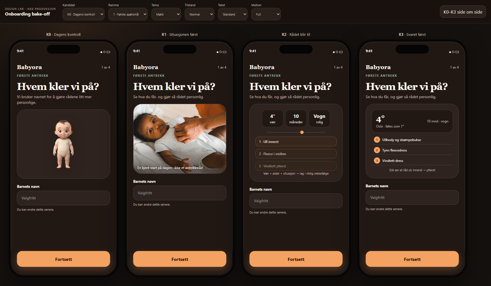

# Fase 3 — K0–K3-retninger

**Status:** Klar for EIERPORT 1. Ingen produksjonskode eller Higgsfield-asset er laget.

## Felles testkontrakt

Alle kandidatene bruker samme norske fixture: Oslo, 4 °C/føles som 1 °C, 10 måneder, trilletur og samme ordnede plaggresultat. De har samme seks brukerhandlinger og samme 3,2 sekunders simulerte beregning før første **gyldige** råd. Ingen mock er koblet til motor, `finalizeSafety`, betaling, brukerdata eller analytics.

Storyboardene under viser fem kritiske rammer. Den interaktive mocken beholder sju UI-tilstander slik at K0s faktiske mellomledd kan prøves: første spørsmål, alder, sted, kontroll, velkomst, Hjem/handling og første råd.

## K0 — Dagens kontroll

**Produktmodell:** Babyora blir kjent med barnet gjennom fire korte spørsmål, mens maskoten holder flyten varm.

**Problem den løser:** Lavest ny asset- og driftskostnad; høyest kontinuitet med aktiv app. Den løser ikke produktforståelse før input bedre enn seg selv.

| Ramme | Norsk copy/CTA | Media-type | Media-jobb |
|---|---|---|---|
| 1 · Første interaksjon | «Hvem kler vi på?» / «Fortsett» | Eksisterende 9 366-byte maskot | Varme og avsender |
| 2 · Alder | «Hvor gammel er Mina?» | Samme maskot, mindre | Kontinuitet, ingen ny forklaring |
| 3 · Sted/tillit | «Hvor er hjemme?» | Native stedskontroll | Samler værgrunnlag |
| 4 · Kontroll/velkomst | «Ser dette riktig ut?» → «Dagens råd er klart» | Maskot | Bekreftelse, men siste påstand er for tidlig |
| 5 · Første råd | «Dagens lag» | Native plaggflate | Faktisk produktverdi og sikkerhetscopy |

- **Første frame:** maskot + navnespørsmål. **Første interaktive:** samme. **End frame:** ordnet plaggflate.
- **Tap før motion:** kun eksisterende mikromotion; CTA er umiddelbar. Reduce Motion fjerner den uten meningstap.
- **Tilbake/avbrudd/resume:** tilbake virker; vanlig background-resume beholder React-state, men prosessdød før lagring mister delvis oppsett.
- **Lys/mørk/a11y:** aktiv app støtter lys/mørk og Reduce Motion. Baseline fant 40×40 tilbakeknapp og 34×34 redigeringsknapp; Dynamic Type-proxy og ARIA ble fanget, men dette er ikke fysisk VoiceOver-verifisering.
- **Offline/slow/error:** ingen kritisk media; sted/vær har eksisterende feilhåndtering. Maskotfeil fjerner bare varme.
- **Kompleksitet/kost:** lav; eksisterende asset og kode. Største kostnad er å reparere kontrollens produktfeil, ikke media.
- **Største risiko:** navnet kalles valgfritt, men blokkerer fullføring; alder tillater omtrent 60 måneder; «rådet er klart» er usant på velkomstskjermen.
- **Må være sant for å vinne:** foreldre må forstå jobben og stole på rådet minst like godt som K3 til tross for at produktprøven kommer sent.

| Ekstra element | Dom | Begrunnelse |
|---|---|---|
| Eksisterende maskot | KEEP | Etablert, lett og ikke faglig fasit. |
| «Dagens råd er klart» før beregning | REMOVE | Faktisk feil. |
| Synlig 3,2 s skann | TEST | Behold bare hvis den forklarer ekte behandling; aldri legg mer lasteteater oppå. |
| Navn som «valgfritt» | REMOVE/REPAIR | Copy og validering må være enige. |

## K1 — Situasjonen først

**Produktmodell:** Et autentisk hverdagsfoto gjør påkledningssituasjonen menneskelig før Babyora ber om data.

**Problem den prøver å løse bedre enn K0:** Emosjonell gjenkjennelse og målgruppeforståelse på første skjerm.

| Ramme | Norsk copy/CTA | Media-type | Media-jobb |
|---|---|---|---|
| 1 · Første interaksjon | «Hvem kler vi på?» / «Fortsett» | Ekte Pexels-foto av forelder som knepper body | Situasjonsgjenkjenning; eksplisitt ikke antrekksfasit |
| 2 · Alder | Samme som felles flyt | Ingen foto | Fokus på input |
| 3 · Sted/tillit | «Oslo nå: 4°, føles som 1°» | Native værkort | Forklarer stedsjobben |
| 4 · Kontroll/velkomst | «Alt er klart for første råd» | Native oppsummering | Sann forventningssetting |
| 5 · Første råd | Samme gyldige plaggflate | Native UI | Produktet, ikke fotoet, er fasit |

- **Første frame/interaktive:** foto og navnefelt samtidig; ingen introstep. **End frame:** identisk gyldig råd.
- **Tap før media er ferdig:** CTA er aktiv; trykk avbryter fotoets oppmerksomhetsjobb og går videre. Ingen avspilling må fullføres.
- **Tilbake/avbrudd/resume:** samme som felles mock; warm resume gjenoppretter rammen. Foto repeteres ikke som sperre.
- **Lys/mørk/a11y:** fotoet har konkret alt-tekst og synlig «ikke et antrekksråd». Stor tekst flytter innhold til scroll, CTA er fast. Begge temaer er fanget.
- **Offline/slow/error:** lokal fallback sier «Fra inne til ute. Vi gjør vær, alder og situasjon om til lag.» Treg media dekker aldri CTA.
- **Kompleksitet/kost:** middels/høy. Testfotoet er 114 333 byte, men er ikke produksjonsgodkjent. Produksjon krever samtykke/lisens, representasjonsvalg, cropping, mørk/lys behandling og revisjonseier.
- **Største risiko:** bildet kan leses som omsorgsreklame, ekskludere eller bli tatt som eksempel på korrekt antrekk.
- **Må være sant for å vinne:** K1 må slå K0/K3 på emosjonell relevans og tillit uten flere antrekksfeiltolkninger eller svakere forståelse.

| Ekstra element | Dom | Begrunnelse |
|---|---|---|
| Autentisk foto | TEST | Bare stimulus; ingen gevinst er bevist. |
| Synlig «ikke antrekksråd» | KEEP i test | Hindrer farlig bokstavelig tolkning. |
| Maskot i samme frame | REMOVE | To figurative avsendere skaper kollisjon. |
| Fotorotasjon/familiebibliotek | REMOVE før bevis | Uforholdsmessig drift uten dokumentert effekt. |

## K2 — Rådet blir til

**Produktmodell:** Vær, alder og aktivitet beveger seg inn i en lagrekkefølge slik at personaliseringen blir synlig.

**Problem den prøver å løse bedre enn K0:** Forklare mekanismen og forventet utdata før brukeren investerer i oppsettet.

| Ramme | Norsk copy/CTA | Media-type | Media-jobb |
|---|---|---|---|
| 1 · Første interaksjon | «Vær + alder + situasjon → lag i riktig rekkefølge» / «Fortsett» | CSS-motion-proxy for mulig Higgsfield/image-to-video-storyboard | Forklarer årsak–virkning |
| 2 · Alder | Samme som felles flyt | Ingen motion | Fokus på input |
| 3 · Sted/tillit | Samme native værkort | Native UI | Gjør første signal ekte |
| 4 · Kontroll/velkomst | «Alt er klart for første råd» | Statisk oppsummering | Sann forventningssetting |
| 5 · Første råd | Samme gyldige plaggflate | Native UI | Bekrefter den lærte modellen |

- **Første frame/interaktive:** motion og navnefelt samtidig. **End frame:** identisk gyldig råd.
- **Tap før motion er ferdig:** CTA går videre umiddelbart; ingen narrativ informasjon finnes bare i siste frame.
- **Tilbake/avbrudd/resume:** tilbake viser sekvensen igjen, men brukeren trenger ikke vente. Warm resume er testet.
- **Lys/mørk/a11y:** de tre signalene og lagene finnes som én meningsfull ARIA-beskrivelse. Reduce Motion viser sluttformen statisk. CSS-proxyen er testet; ekte video er ikke det.
- **Offline/slow/error:** statisk poster er komplett og kan bundles lokalt. Ingen nettverksavhengighet tillates.
- **Kompleksitet/kost:** høy og foreløpig ukjent. Ingen Higgsfield-generering er gjort. Produksjon krever modell/prompt/referanse, artefaktkontroll, poster, encoding, VoiceOver-beskrivelse og drift ved faglig endring.
- **Største risiko:** premiumteater og autoplay kan bruke opp tid uten å forbedre forståelse; en generert baby/plaggscene kan dessuten bli faglig tvetydig.
- **Må være sant for å vinne:** K2 må gi bedre korrekt gjenfortelling av de tre inputene og lagrekkefølgen enn K3s statiske demo, også i Reduce Motion.

| Ekstra element | Dom | Begrunnelse |
|---|---|---|
| Årsak–virkning-motion | TEST | Har en tydelig jobb, men ingen brukergevinst er vist. |
| Higgsfield-fotorealistisk baby | REMOVE | Unødvendig ekthets- og sikkerhetsrisiko. |
| Statisk poster | KEEP | Må være fullverdig fallback. |
| Låst autoplay/skip-step | REMOVE | CTA skal aldri vente. |

## K3 — Svaret først

**Produktmodell:** En native minidemonstrasjon viser Babyoras faktiske utdata før første spørsmål.

**Problem den løser bedre enn K0:** Produktforståelse og første opplevde verdi uten ekstra media, steg eller venting.

| Ramme | Norsk copy/CTA | Media-type | Media-jobb |
|---|---|---|---|
| 1 · Første interaksjon | «Slik ser et råd ut: innerst → ytterst» / «Fortsett» | Native værkort + tre eksempelplagg | Viser konkret input og output |
| 2 · Alder | Samme som felles flyt | Native kontroll | Samler ett av de viste signalene |
| 3 · Sted/tillit | Samme native værkort | Native UI | Knytter samtykke til synlig nytte |
| 4 · Kontroll/velkomst | «Alt er klart for første råd» | Native oppsummering | Sann forventningssetting |
| 5 · Første råd | Full seksdelt plaggflate | Native UI | Gyldig, personalisert verdi |

- **Første frame/interaktive:** eksempel og navnefelt samtidig. **End frame:** identisk gyldig råd.
- **Tap før motion:** ingen nødvendig motion. Trykk er umiddelbart.
- **Tilbake/avbrudd/resume:** full mening i alle rammer; warm resume ble automatisk gjenopprettet til korrekt ramme.
- **Lys/mørk/a11y:** bare semantisk tekst/UI. Stor tekst, VoiceOver-tre, 44 pt og Reduce Motion består web-previewen.
- **Offline/slow/error:** førsteframen er lokal HTML/CSS; ingen asset kan feile. Stedsfeil har manuell vei.
- **Kompleksitet/kost:** lav. Ingen rettighetskost eller binær asset; vedlikehold følger samme UI-/copykontrakt som selve produktet.
- **Største risiko:** kan føles mer nyttig enn varm og kan ligne en generell værapp hvis Babyora-identiteten blir for svak.
- **Må være sant for å vinne:** brukere må forstå jobben bedre enn K0 uten et vesentlig tap i tillit eller emosjonell relevans.

| Ekstra element | Dom | Begrunnelse |
|---|---|---|
| Native minidemonstrasjon | TEST/KEEP som finalist | Sterkeste evidensnære hypotese. |
| Ekte lokaldata i onboarding | TEST senere | Krever korrekt samtykke og motorgrense; fixture nå. |
| Maskot i demoen | REMOVE | Gir mindre plass til mekanismen; kan komme senere i flyten. |
| Før/etter-løfte | REMOVE | Babyora skal vise råd, ikke overdrive transformasjon. |

## Sammenligning og foreløpig rangering

Poengene bruker planens 100-poengsmatrise som en **ekspertproxy**, ikke brukerscore. Usikkerhetsintervallet er bredt fordi ingen foreldre er testet og K2 ikke har en ekte Higgsfield-asset.

| Rang | Kandidat | Forståelse 20 | Tillit 20 | Tid 15 | Emosjon 10 | Merkevare 10 | Native 10 | Robusthet 10 | Drift 5 | Sum | Usikkerhet | Hard-fail nå |
|---:|---|---:|---:|---:|---:|---:|---:|---:|---:|---:|---|---|
| 1 | K3 | 18 | 17 | 13 | 5 | 8 | 10 | 10 | 5 | **86** | ±8 | Ingen i web-mock; native ukjent |
| 2 | K0 | 12 | 12 | 8 | 8 | 9 | 8 | 6 | 5 | **68** | ±9 | **Ja uendret:** navne-dead-end; små mål |
| 3 | K2 | 14 | 11 | 10 | 6 | 8 | 7 | 6 | 1 | **63** | ±12 | Ekte media/Reduce Motion er uverifisert |
| 4 | K1 | 11 | 11 | 10 | 8 | 4 | 7 | 8 | 2 | **61** | ±11 | Produksjonsrettighet/representasjon uløst |

### Hvorfor taperne taper foreløpig

- **K1:** bildet er menneskelig, men forklarer ikke Babyoras mekanisme og ser generisk ut. Kostnadslinjen er svak: det som går tapt uten foto er stemning, ikke funksjon.
- **K2:** motion har en legitim forklaringsjobb, men K3 kommuniserer samme modell statisk, billigere og mer robust. Higgsfield er ikke berettiget før K3 faktisk feiler forståelsestesten.
- **K0:** retningen er fortsatt relevant og må være kontroll, men dagens implementasjon kan ikke vinne uendret på grunn av observerte funksjons-/tilgjengelighetsfeil.

## Automatisert mock-verifikasjon

| Kontroll | Resultat |
|---|---|
| Viewport | 390×844, DPR 2; ingen horisontal overflow |
| Trykkmål | Alle synlige mock-kontroller ≥44×44; CTA også fullt innenfor viewport ved stor tekst |
| Tema/tekst | K0–K3 lys/mørk; K3 stor-tekst-proxy fanget |
| VoiceOver-proxy | ARIA-snapshot for alle første- og sluttrammer |
| Reduce Motion | K2 statisk sluttform; beregnet animasjonsvarighet 0,000001 s |
| Robusthet | K1 offline og treg media, K3 error, warm resume og lokalt posterløp består |
| Reell resultattid | Samme seks handlinger; slutt-CTA → resultat 3 314–3 382 ms i siste lokale Chromium-kjøring |
| Konsoll | 0 feil |

Dette er eksplisitt web-preview-evidens. Ingen kandidat er kalt native-verifisert før fysisk støttet iPhone/simulator er testet i en senere fase.

## Anbefalte finalister

1. **K3 — Svaret først.** Den tester den sterkeste fjerningshypotesen med lavest kost og tydeligst produktjobb.
2. **K0 — Dagens kontroll, med kun kontraktreparasjoner før test.** Navn må enten bli reelt valgfritt eller tydelig obligatorisk; aldersscope må være 0–24 måneder; små mål må bli 44 pt. Ingen ny media legges til.

K1 og K2 stoppes ved eierporten. De er dokumenterte utfordrere, ikke produksjonsforslag.
