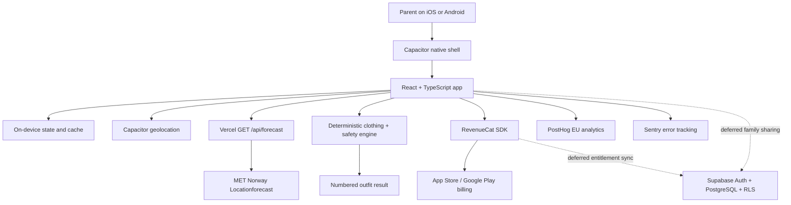

# PRD — Snudly

## 1. Overview

### Product Summary

**Snudly tells parents what their baby should wear today.** It is a mobile decision aid for parents of children aged 0–24 months, starting with first-time Norwegian dads. The app combines local weather from MET Norway with the child's age and an activity context, applies deterministic safety rules, and returns one numbered outfit in dressing order with a short explanation.

The product is built as a React/TypeScript/Vite application packaged for iOS and Android with Capacitor. This PRD treats the existing repository as a functional prototype: preserve verified logic and integrations, but do not treat its screens, colors, layout, or components as fixed product requirements.

### Objective

Deliver the MVP defined in `docs/product-vision.md` § MVP Definition: one local child and home location, four-context outfit recommendations, deterministic safety overrides, a numbered result, first value before the paywall, monthly/annual RevenueCat subscriptions, Norwegian public-quality localization, controlled Swedish/Danish pilot localization, privacy-safe PostHog analytics, and scrubbed Sentry crash reporting.

The implementation ends in a 14-day behavioral test with 20 dads: 10 in Norway, 5 in Sweden, and 5 in Denmark. Family sharing, public Android release, and broad multi-country launch remain deferred.

### Market Differentiation

The implementation must prove that Snudly is not a temperature lookup with nicer illustrations. The recommendation contract must account for infant age, stroller, carrier, outdoor play, indoor sleep, and car-seat context; safety rules must remain deterministic and non-overridable; and results must be shown in the order a parent puts the garments on. Norwegian safety content is release-quality. Swedish and Danish safety content remains explicitly pilot-only until country review is recorded.

### Magic Moment

The magic moment occurs when a dad taps **“Finn dagens antrekk”** and receives one complete, numbered outfit for the current child, activity, and weather within seconds. The technical path must minimize setup, avoid mandatory authentication, show the first real recommendation before a paywall, use a fresh or clearly labeled cached forecast, and never render a partial recommendation as complete.

Targets:

- First-use onboarding to recommendation: median under 60 seconds.
- Returning recommendation with current inputs: under 5 seconds, with a safe fresh cache rendered immediately when available.
- Safety validation: 100% pass rate for the approved boundary-scenario suite.
- Result comprehension: a tester can repeat the outfit and primary reason without navigating away.

### Success Criteria

| Criterion | Done threshold |
|---|---:|
| P0 functional requirements | 100% implemented and verified |
| Unit/integration tests for safety, weather, state, billing, and analytics contracts | Green in CI |
| Critical iOS journey on a physical device | Onboarding → recommendation → paywall → purchase/restore passes |
| First-use magic-moment completion | ≥70% during pilot |
| 14-day repeat use | ≥12 of 20 testers request recommendations on 4+ days |
| Genuine payment commitment | ≥5 of 20 testers |
| Trial-to-paid after launch | ≥15% good; ≥20% great |
| Crash-free sessions | ≥99.5% |
| Accessibility | WCAG 2.2 AA behavior and manual VoiceOver/Dynamic Type pass on core flow |

## 2. Technical Architecture

### Architecture Overview



The core MVP is local-first. Child profiles and the active recommendation state live on-device; no account is required. The only required server request in the magic-moment path is the privacy-bounded forecast proxy. RevenueCat communicates through the native store SDK. Supabase is retained as the selected backend for later family sharing but is not allowed to block the validation MVP.

### Chosen Stack

| Layer | Choice | Rationale |
|---|---|---|
| Frontend | React, TypeScript, Vite, Capacitor | Preserves the working shared codebase and native iOS/Android projects |
| Backend | Vercel Edge Functions; Supabase for deferred shared features | Vercel satisfies MET Norway's server-side User-Agent requirement; Supabase supports later auth, RLS, and sync |
| Database | On-device local storage for launch; Supabase PostgreSQL later | The magic moment needs no account or network database; shared caregivers will need durable, access-controlled data |
| Auth | Supabase Auth, deferred until family sharing | Apple/Google auth should appear only when a shared capability requires identity |
| Payments | RevenueCat | One entitlement model across native stores, using package types rather than hard-coded product IDs |
| Analytics | PostHog EU | Already integrated; supports privacy-safe funnel measurement and opt-out |
| Error tracking | Sentry | Adds crash and failure visibility before TestFlight and public release |
| Email | None | No MVP email flow; do not add a transactional provider until auth or lifecycle messaging requires one |
| Weather | MET Norway Locationforecast via Vercel proxy | Strong Nordic coverage and existing implementation |
| State | Zustand plus React context/local storage | Already used for subscription, location, UI, and child state |
| Localization | i18next, react-i18next | Existing Norwegian, Swedish, Danish, English, and German catalogs |
| CI/CD | Codemagic plus GitHub | Existing native build configuration and repository workflow |

### Stack Integration Guide

1. **Preserve the working technical foundation.** Install dependencies with `npm ci`; verify `npm test`, `npm run lint`, `npm run build`, and the relevant E2E scripts before changing behavior. Reuse verified domain logic and native integrations. Screens and visual components may be replaced. Do not recreate the Capacitor projects or change bundle ID `no.klemeg.app`.

2. **Keep core recommendation local.** `src/lib/clothing-engine-v2/` and the compatibility layer in `src/lib/wool-layers/` own deterministic recommendations. UI code calls typed adapters; it never constructs safety output or mutates guardrail results.

3. **Fetch weather through the existing proxy.** Web uses `/api/forecast`; native uses `VITE_FORECAST_PROXY`. Send `lat`, `lon`, and `cacheScope=memory-only` only when automatic-location privacy requires no shared cache. The edge function rounds coordinates to four decimals, uses a MET-compliant User-Agent, caches fixed-home requests for 15 minutes, and rate-limits memory-only requests.

4. **Initialize native services after Capacitor readiness.** `src/main.tsx` initializes RevenueCat and PostHog. Add Sentry initialization before React render, but keep every SDK a no-op when its public configuration is absent in local preview.

5. **Keep Supabase deferred behind a service boundary.** Do not replace `ChildrenProvider` during the validation MVP. When family sharing is authorized, add `src/lib/supabase/client.ts` and repository modules without changing the screen-facing child-store interface.

Required client/build variables:

| Variable | Scope | Secret? | Purpose |
|---|---|---:|---|
| `VITE_FORECAST_PROXY` | Client | No | Absolute forecast proxy URL in native builds |
| `VITE_METNO_USER_AGENT` | Server/build documentation | Contact-bearing, not credential | MET identification; server remains authoritative |
| `VITE_REVENUECAT_PUBLIC_KEY_IOS` | Client | Public SDK key | RevenueCat iOS app configuration |
| `VITE_REVENUECAT_PUBLIC_KEY_ANDROID` | Client | Public SDK key | RevenueCat Android app configuration |
| `VITE_POSTHOG_KEY` | Client | Public project key | Product analytics |
| `VITE_POSTHOG_HOST` | Client | No | Use EU host |
| `VITE_SENTRY_DSN` | Client | Public DSN | Error delivery endpoint |
| `SENTRY_AUTH_TOKEN` | CI only | Yes | Source-map upload; never bundle or commit |
| `SENTRY_ORG`, `SENTRY_PROJECT` | CI/build | No | Release/source-map association |
| `VITE_SUPABASE_URL` | Client, deferred | No | Future Supabase project URL |
| `VITE_SUPABASE_PUBLISHABLE_KEY` | Client, deferred | Public/RLS-bound | Future auth/database client |

Common gotchas:

- Never hard-code store price strings or Apple/Google product IDs in React components. Render RevenueCat's localized store price; use `PRODUCTS` only as an explicit offline fallback.
- Never put a Supabase service-role key, Apple private key, Sentry auth token, or Google service-account JSON in a Vite variable.
- A cached forecast is not automatically a valid cached recommendation. The recommendation fingerprint must include child age basis, activity, weather evaluation time, location scope, engine version, and relevant context.
- Automatic-location coordinates are session-only and use `memory-only` cache scope. Do not persist them or include them in analytics/Sentry breadcrumbs.
- Swedish/Danish UI translation status and Swedish/Danish safety-review status are separate gates.

### Repository Structure

```text
snudly/
├── api/
│   ├── forecast.ts                    # Vercel edge proxy for MET Norway
│   └── __tests__/forecast.test.ts
├── src/
│   ├── App.tsx                        # Tab/drill routing and global gates
│   ├── main.tsx                       # SDK initialization and React entry
│   ├── screens/                       # Onboarding, Home, outfit, plan, family, tools
│   ├── components/                    # Shared and feature-specific UI
│   ├── state/                         # Child, location, subscription, feedback state
│   ├── lib/
│   │   ├── clothing-engine-v2/        # Canonical deterministic engine
│   │   ├── wool-layers/               # Compatibility and safety contracts
│   │   ├── met-no/                    # Forecast validation and extraction
│   │   ├── billing/revenuecat.ts      # Native purchase adapter
│   │   ├── analytics/track.ts         # Only permitted analytics surface
│   │   ├── monitoring/sentry.ts       # Add: scrubbed Sentry initialization
│   │   ├── supabase/                  # Deferred: auth/data repositories
│   │   └── gdpr/local-data.ts         # Local-data inventory and deletion
│   ├── i18n/locales/                  # no, sv, da, en, de message catalogs
│   └── styles/                        # Exploratory styles; not a locked visual contract
├── ios/                               # Capacitor iOS project; bundle ID is locked
├── android/                           # Capacitor Android project; public launch deferred
├── e2e/                               # Smoke and purchase flows
├── docs/                              # Vision, PRD, roadmap, evidence, future design.md
├── codemagic.yaml                     # Native CI/CD pipelines
├── capacitor.config.ts                # Native app configuration
├── vite.config.ts                     # Web build and build metadata
└── package.json                       # Scripts and dependency source of truth
```

`docs/design.md` does not yet exist. Before production styling, run a time-boxed design exploration using external references and at least three distinct directions. Existing `DESIGN.md`, CSS, and design-lab artifacts may inform the work but are not the default or a constraint. The resulting `docs/design.md` is provisional and versioned; user evidence may change it.

### Infrastructure & Deployment

**Web/edge:** Deploy the Vite web build and `api/forecast.ts` to the existing Vercel project. Production native builds set `VITE_FORECAST_PROXY` to the stable HTTPS forecast endpoint. Configure spend alerts; do not enable paid add-ons automatically.

**iOS:** Use Capacitor sync and the existing `ios/` project. Codemagic builds, signs, and uploads TestFlight artifacts. Preserve bundle ID `no.klemeg.app`; update only the approved display name, store metadata, and schemes according to the existing rename plan.

**Android:** Keep the project buildable and package-compatible, but do not make a public Play release part of the validation MVP. Signing keys, Play products, and RevenueCat mappings require owner-controlled console actions.

**Supabase:** Keep the existing project paused or unused until a shared feature is authorized. When enabled, apply schema migrations and RLS together; never create a table reachable from the client without a tested policy.

**Deployment gates:** A candidate is releasable only when unit tests, TypeScript build, lint baseline policy, smoke E2E, purchase E2E, safety scenario export, physical-device verification, privacy copy, and store metadata evidence are complete.

### Security Considerations

1. **Data minimization:** Child name, birth date, material preference, and fixed home location stay on-device in the validation MVP. Only rounded coordinates are sent for weather. No child data enters PostHog or Sentry.

2. **Safety integrity:** Recommendation and safety modules are pure, deterministic, versioned, and covered by boundary tests. UI substitutions call the engine again; they cannot delete a hard safety flag.

3. **API protection:** Forecast input validates finite latitude/longitude ranges. Memory-only traffic is no-store and rate-limited. Error responses do not echo upstream payloads or internal details.

4. **Secrets:** Vite variables are considered public. CI secrets remain in Codemagic/Vercel/Sentry stores. Pre-push checks must block private keys, service-role keys, service-account JSON, and local `.env` files.

5. **Monitoring privacy:** Configure Sentry `beforeSend` and breadcrumb filtering to remove names, dates of birth, coordinates, URLs containing location parameters, store receipts, tokens, and recommendation payloads. Disable default user-IP collection where the SDK/account supports it.

6. **Future auth/RLS:** Supabase Auth uses PKCE and native deep links. Every `children`, `caregiver_access`, `device_tokens`, and subscription-sync row is owner-scoped; cross-household access is impossible without an accepted invitation and tested RLS.

### Cost Estimate

Current prices must be rechecked before any commitment; no new single or aggregate commitment above NOK 1,000 is authorized automatically.

| Service | Low-scale estimate | Included/trigger | Source |
|---|---:|---|---|
| Vercel Pro | $20/month | One deploying seat, $20 usage credit, 10M edge requests and 1 TB transfer included | [Vercel Pro](https://vercel.com/docs/plans/pro-plan) |
| Supabase | $0 while deferred/paused; $25/month for Pro when shared production data launches | Free supports 50k MAU but pauses; Pro includes 100k MAU and daily backups | [Supabase pricing](https://supabase.com/pricing) |
| PostHog | $0 at pilot scale | 1M product analytics events/month free | [PostHog pricing](https://posthog.com/) |
| Sentry | $0 on Developer plan for pilot | Confirm current event quota in the selected account before enabling performance tracing | [Sentry](https://sentry.io/pricing/) |
| RevenueCat | $0 below $2,500 monthly tracked revenue; then 1% of tracked revenue | Store commission is separate | [RevenueCat pricing](https://www.revenuecat.com/pricing) |
| Apple Developer Program | $99/year (about $8.25/month equivalent) | Required for TestFlight/App Store | [Apple membership](https://developer.apple.com/programs/whats-included/) |
| Google Play | $25 one-time, deferred | Public Android release not in MVP | [Play Console registration](https://support.google.com/googleplay/android-developer/answer/6112435) |

Expected validation baseline: approximately **$28.25/month equivalent** for Vercel Pro plus Apple membership, before any existing project-specific spend and store commission. Enabling Supabase Pro brings the infrastructure baseline to approximately **$53.25/month equivalent**. PostHog, Sentry, and RevenueCat should remain at $0 at the 20-user pilot scale.

## 3. Data Model

### Entity Definitions

#### Launch model: on-device TypeScript entities

```typescript
type ChildProfile = {
  id: string;                         // UUID/string, required
  name: string;                       // 1–80 chars; local display only
  dob: string;                        // ISO YYYY-MM-DD; required
  city: string;                       // 1–120 chars; required
  lat: number;                        // -90..90; fixed-home coordinate
  lon: number;                        // -180..180
  color: string;                      // Existing avatar color token
  avatarKey?: string;
  canRoll?: 'yes' | 'no' | 'unknown';
  materialPreference: 'best_for_conditions' | 'prefer_wool' | 'avoid_wool';
};

type LocationPreference = {
  mode: 'manual' | 'auto';            // Only durable field
  automaticPlace: {
    childId: string;
    city: string;
    lat: number;
    lon: number;
    generation: number;
  } | null;                           // Session-only; never persisted
};

type RecommendationInput = {
  childId: string;
  ageMonths: number;                  // 0..24 supported for launch
  canRoll?: boolean;                  // yes/no from profile; unknown stays undefined
  activity: 'vogn' | 'baeresele' | 'utelek' | 'soevn';
  weather: {
    feelsLikeC: number;
    tempC: number;
    windMs: number;
    precipMmH: number;
    humidity?: number;
    symbolCode?: string;
    uvIndex?: number;
  };
  exposureMin?: number;               // Default 60
  innerJakke?: boolean;
  vognMode?: 'awake' | 'sleeping';
  context?: { bilstol?: boolean };
  childCalibration?: -1 | 0 | 1;      // Deferred in validation MVP
};

type RecommendationResult = {
  engineVersion: string;
  activity: RecommendationInput['activity'];
  tempBand: string;
  layers: Array<{
    category: 'innerst' | 'mellomlag' | 'yttertoy' | 'ekstra' | 'utstyr';
    items: string[];
  }>;
  notes: Array<{ category: string; message: string }>;
  summary: string;
  safetyFlags: SafetyFlag[];
  severity: 'none' | 'info' | 'warning' | 'critical';
};

type SafetyFlag = {
  ruleId: string;                     // Stable versioned identifier
  severity: 'info' | 'warning' | 'critical';
  messageKey: string;                 // Localized at render time
  sourceIds: string[];                // One or more approved sources
  blocksOverride: boolean;
};

type RecommendationCacheEntry = {
  fingerprint: string;                // Hash of every input, including canRoll, + engine version
  result: RecommendationResult;
  evaluatedAt: string;                // ISO timestamp added by orchestration, never the pure engine
  weatherObservedAt: string;
  createdAt: string;
  expiresAt: string;
  cacheScope: 'persistent' | 'memory-only';
};

type SubscriptionSnapshot = {
  isPremium: boolean;
  lastSyncedAt: number | null;
  firstRecommendationSeenAt: number | null;
  recommendationGraceWindowActive: boolean; // Session-only
};

type PilotEvent = {
  anonymousId: string;
  event:
    | 'onboarding_completed'
    | 'recommendation_requested'
    | 'recommendation_rendered'
    | 'recommendation_failed'
    | 'paywall_viewed'
    | 'trial_started'
    | 'purchase_completed'
    | 'purchase_cancelled';
  country: 'NO' | 'SE' | 'DK';
  occurredAt: string;
  properties: Record<string, string | number | boolean | null>;
};
```

Storage keys remain versioned and backward-compatible. Invalid stored records are ignored or migrated to safe defaults; corrupted local data must never crash onboarding.

#### Deferred Supabase PostgreSQL model

Create only after family sharing is authorized:

```sql
CREATE TABLE public.profiles (
  user_id UUID PRIMARY KEY REFERENCES auth.users(id) ON DELETE CASCADE,
  display_name TEXT CHECK (char_length(display_name) BETWEEN 1 AND 80),
  locale TEXT NOT NULL DEFAULT 'no' CHECK (locale IN ('no', 'sv', 'da')),
  created_at TIMESTAMPTZ NOT NULL DEFAULT now(),
  updated_at TIMESTAMPTZ NOT NULL DEFAULT now()
);

CREATE TABLE public.children (
  id UUID PRIMARY KEY DEFAULT gen_random_uuid(),
  owner_user_id UUID NOT NULL REFERENCES auth.users(id) ON DELETE CASCADE,
  name TEXT NOT NULL CHECK (char_length(name) BETWEEN 1 AND 80),
  dob DATE NOT NULL,
  city TEXT NOT NULL CHECK (char_length(city) BETWEEN 1 AND 120),
  lat NUMERIC(7,4) NOT NULL CHECK (lat BETWEEN -90 AND 90),
  lon NUMERIC(7,4) NOT NULL CHECK (lon BETWEEN -180 AND 180),
  can_roll TEXT CHECK (can_roll IN ('yes', 'no', 'unknown')),
  material_preference TEXT NOT NULL DEFAULT 'best_for_conditions'
    CHECK (material_preference IN ('best_for_conditions', 'prefer_wool', 'avoid_wool')),
  created_at TIMESTAMPTZ NOT NULL DEFAULT now(),
  updated_at TIMESTAMPTZ NOT NULL DEFAULT now()
);

CREATE TABLE public.caregiver_access (
  id UUID PRIMARY KEY DEFAULT gen_random_uuid(),
  child_id UUID NOT NULL REFERENCES public.children(id) ON DELETE CASCADE,
  caregiver_user_id UUID NOT NULL REFERENCES auth.users(id) ON DELETE CASCADE,
  role TEXT NOT NULL CHECK (role IN ('owner', 'caregiver')),
  status TEXT NOT NULL DEFAULT 'pending' CHECK (status IN ('pending', 'accepted', 'revoked')),
  created_at TIMESTAMPTZ NOT NULL DEFAULT now(),
  UNIQUE (child_id, caregiver_user_id)
);

CREATE TABLE public.device_tokens (
  id UUID PRIMARY KEY DEFAULT gen_random_uuid(),
  user_id UUID NOT NULL REFERENCES auth.users(id) ON DELETE CASCADE,
  platform TEXT NOT NULL CHECK (platform IN ('ios', 'android')),
  token TEXT NOT NULL,
  created_at TIMESTAMPTZ NOT NULL DEFAULT now(),
  updated_at TIMESTAMPTZ NOT NULL DEFAULT now(),
  UNIQUE (platform, token)
);

CREATE TABLE public.subscription_snapshots (
  user_id UUID PRIMARY KEY REFERENCES auth.users(id) ON DELETE CASCADE,
  revenuecat_app_user_id TEXT NOT NULL UNIQUE,
  entitlement TEXT NOT NULL,
  active BOOLEAN NOT NULL DEFAULT false,
  expires_at TIMESTAMPTZ,
  source_event_id TEXT UNIQUE,
  updated_at TIMESTAMPTZ NOT NULL DEFAULT now()
);
```

Do not store recommendation results or detailed weather histories in Supabase by default. Shared features should recompute from current data and retain only the minimum state required for coordination.

### Relationships

- `auth.users` 1:1 `profiles`; delete cascades to the profile.
- `auth.users` 1:many `children` through `owner_user_id`; deleting the owner deletes owned child rows after explicit account-deletion confirmation.
- `children` 1:many `caregiver_access`; accepted rows grant read access, while only the owner can edit or delete the child.
- `auth.users` 1:many `device_tokens`; tokens are revoked on logout/account deletion.
- `auth.users` 1:1 `subscription_snapshots`; server webhook state supplements, but does not replace, immediate native RevenueCat entitlement checks.

### Indexes

```sql
CREATE INDEX children_owner_idx ON public.children(owner_user_id);
CREATE INDEX caregiver_access_user_status_idx
  ON public.caregiver_access(caregiver_user_id, status);
CREATE INDEX caregiver_access_child_status_idx
  ON public.caregiver_access(child_id, status);
CREATE INDEX device_tokens_user_idx ON public.device_tokens(user_id);
CREATE INDEX subscription_active_expiry_idx
  ON public.subscription_snapshots(active, expires_at);
```

These indexes support owner lists, caregiver-visible child lists, invitation resolution, token cleanup, and entitlement reconciliation. Do not add indexes speculatively beyond measured query needs.

## 4. API Specification

### API Design Philosophy

The validation MVP uses one REST edge endpoint for weather and typed local module calls for recommendations, billing, analytics, and persistence. The core engine is not exposed as a public API: it is synchronous, deterministic application code. Responses use `{ error: string }` for edge failures. No pagination is needed.

When Supabase is activated, screens call repository functions backed by the Supabase client rather than raw `.from()` calls scattered through components. Supabase Auth bearer tokens and RLS are mandatory for shared data.

### Endpoints

#### GET `/api/forecast`

Fetch a MET Norway compact forecast through the Vercel edge runtime.

```text
GET /api/forecast?lat=63.4305&lon=10.3951&cacheScope=persistent
Auth: None
Query:
  lat: number, required, -90..90
  lon: number, required, -180..180
  cacheScope?: "persistent" | "memory-only"; default persistent

Response 200: MET Norway Locationforecast compact GeoJSON payload
Response 400: { "error": "Ugyldig lat/lon" }
Response 429: { "error": "For mange forespørsler. Prøv igjen om litt." }
              Retry-After: 60
Response 502: { "error": "met.no utilgjengelig" }
```

Behavior:

- `persistent`: edge cache `s-maxage=900, stale-while-revalidate=600`.
- `memory-only`: `private, no-store`; best-effort 30 requests/minute per edge-visible client.
- Upstream coordinates are rounded to four decimals.
- `OPTIONS` returns 204; non-GET methods return 405.

#### Local recommendation contract

```typescript
// src/lib/clothing-engine-v2/recommend.ts
function recommend(input: RecommendationInput): RecommendationResult;

// Requirements
// - Pure: no fetch, Date.now, storage, analytics, or UI access.
// - Runs safety finalization after preferences/substitutions/calibration.
// - Returns a complete result or throws a typed EngineContractError.
// - Engine version is included in cache fingerprints and review evidence.
```

#### RevenueCat adapter contract

```typescript
type EntitlementCheckResult =
  | { status: 'active' }
  | { status: 'inactive' }
  | { status: 'unavailable'; errorCode: string };

type RestoreResult =
  | { status: 'restored' }
  | { status: 'nothing-to-restore' }
  | { status: 'unavailable'; errorCode: string };

initRevenueCat(userId?: string): Promise<void>;
checkPremium(): Promise<EntitlementCheckResult>;
getOfferings(): Promise<PurchasesOffering | null>;
purchasePlan(plan: 'monthly' | 'yearly'): Promise<PurchaseResult>;
restorePurchases(): Promise<RestoreResult>;
```

The adapter resolves plans through RevenueCat package types. It never accepts an App Store product ID from UI code. An `unavailable` entitlement check preserves the last-known entitlement instead of converting a network or SDK error into `inactive`.

#### Deferred Supabase repository contracts

```typescript
childrenRepository.listVisible(): Promise<ChildProfile[]>;
childrenRepository.create(input: NewChildInput): Promise<ChildProfile>;
childrenRepository.update(id: string, patch: ChildPatch): Promise<ChildProfile>;
childrenRepository.remove(id: string): Promise<void>;
caregiverRepository.invite(childId: string, recipient: InviteRecipient): Promise<Invite>;
caregiverRepository.accept(token: string): Promise<void>;
```

All calls require a valid Supabase session and pass through RLS. These are post-validation contracts, not MVP tasks.

#### Deferred RevenueCat webhook

```text
POST /functions/v1/revenuecat-webhook
Auth: RevenueCat webhook authorization header, validated server-side
Body: RevenueCat event payload
Response 200: { "received": true }
Response 400: { "error": "Invalid event" }
Response 401: { "error": "Unauthorized" }
```

Process idempotently using the RevenueCat event ID. Map only the configured `premium` entitlement to `subscription_snapshots`; never trust a client-provided entitlement value.

## 5. User Stories

### Epic: First Value

**US-001: Set up one child locally**
As Martin, I want to enter only the information needed for a recommendation so that I reach value without creating an account.

Acceptance Criteria:
- [ ] Given a fresh install, when Martin enters a valid birth date and home place, then a local child profile is created and onboarding completes.
- [ ] Given invalid or future birth data, when he continues, then the screen explains the correction in plain language and stores nothing invalid.
- [ ] Given storage is unavailable, when he completes onboarding, then the app remains usable for the session and states that changes may not be saved.

**US-002: Use current or manual location**
As Martin, I want Snudly to use the right place without retaining unnecessary movement data so that the weather is relevant and private.

Acceptance Criteria:
- [ ] Manual home location works without geolocation permission.
- [ ] Automatic coordinates remain session-only and use `memory-only` forecast caching.
- [ ] Denied permission preserves manual mode and offers a place-entry recovery path.

### Epic: Recommendation

**US-003: Get today's outfit**
As Martin, I want one outfit for my baby, activity, and weather so that I can dress the child without asking someone else.

Acceptance Criteria:
- [ ] The user can select stroller, carrier, outdoor play, or indoor sleep.
- [ ] A successful calculation displays every layer in dressing order with category and rationale.
- [ ] The first real result is visible before any paywall blocks it.

**US-004: Understand safety boundaries**
As Martin, I want warnings to explain what must change and why so that I can act without being frightened or confused.

Acceptance Criteria:
- [ ] Hard safety rules cannot be dismissed or overridden.
- [ ] Each safety message resolves from a localized message key and traceable source ID.
- [ ] Unreviewed country/rule combinations are blocked from public release.

**US-005: Substitute a garment safely**
As Martin, I want an alternative when I do not own the suggested garment so that the answer remains practical.

Acceptance Criteria:
- [ ] Only pre-authorized equivalents appear.
- [ ] Confirming a substitute reruns safety finalization.
- [ ] A substitution that weakens a hard requirement is rejected with a calm explanation.

**US-006: Recover from stale or unavailable weather**
As Martin, I want a useful and honest fallback when the network fails so that I know whether the previous answer is still usable.

Acceptance Criteria:
- [ ] Fresh cached recommendations render with their evaluation time.
- [ ] Stale results are labeled and never presented as current.
- [ ] With no valid data, the app shows retry and manual-place actions instead of a fabricated outfit.

### Epic: Subscription

**US-007: Experience value before the offer**
As Martin, I want to see one real recommendation before choosing a subscription so that I understand what I am paying for.

Acceptance Criteria:
- [ ] The first recommendation remains readable for the current session.
- [ ] A later locked action or subsequent app session can present the paywall according to the approved gate.
- [ ] Paywall text uses live store prices and accurately states trial and renewal terms.

**US-008: Purchase or restore access**
As a subscriber, I want purchase and restore to update immediately so that I can continue without restarting.

Acceptance Criteria:
- [ ] Monthly and annual plans map to RevenueCat package types.
- [ ] Successful purchase activates `premium` and updates local state.
- [ ] Cancellation, pending, missing package, and store failure each receive a distinct recoverable response.

### Epic: Validation and Trust

**US-009: Use reviewed local language**
As a Scandinavian pilot user, I want the flow in my language and safety context so that I can judge it fairly.

Acceptance Criteria:
- [ ] Norwegian core strings and safety rules are release-approved.
- [ ] Swedish and Danish pilots contain no untranslated core-flow strings.
- [ ] Pilot labels prevent unreviewed Swedish/Danish rule sets from being treated as production-approved.

**US-010: Control analytics privacy**
As a parent, I want product measurement to avoid my child's personal data so that validation does not compromise privacy.

Acceptance Criteria:
- [ ] The analytics layer rejects forbidden property names and payload types.
- [ ] Opt-out stops future captures and clears the local analytics identifier where supported.
- [ ] Sentry events are scrubbed before delivery and contain no child or location payload.

## 6. Functional Requirements

### Profile and Location

**FR-001: Local child profile**
Priority: P0
Description: Create, parse, migrate, update, and delete one launch child profile using the existing `ChildrenProvider` contract.
Acceptance Criteria:
- Required fields validate before persistence.
- Ages 0–24 months are fully supported; older ages show a soft boundary and are excluded from pilot results.
- Corrupted stored entries are ignored without crashing.
Related Stories: US-001

**FR-002: Privacy-bounded location**
Priority: P0
Description: Support fixed home and session-only automatic location through `location-pref-store`.
Acceptance Criteria:
- Only `mode` persists for automatic location.
- Coordinates validate before forecast requests.
- Permission denial and geocode failure preserve a manual path.
Related Stories: US-002

### Weather and Recommendation

**FR-003: Forecast proxy contract**
Priority: P0
Description: Fetch and validate MET compact forecasts through `/api/forecast`, preserving cache-scope privacy.
Acceptance Criteria:
- Fixed-home and memory-only cache headers match the API specification.
- 400/429/upstream failures map to typed client errors.
- UI displays source attribution and forecast freshness.
Related Stories: US-002, US-006

**FR-004: Four activity contexts**
Priority: P0
Description: Accept `vogn`, `baeresele`, `utelek`, and `soevn`, including carrier/stroller sub-context needed by the engine.
Acceptance Criteria:
- Activity is part of every recommendation fingerprint.
- Changing activity causes a recalculation.
- Indoor sleep ignores outdoor-only modifiers and follows its approved safety table.
Related Stories: US-003

**FR-005: Deterministic outfit engine**
Priority: P0
Description: Generate a complete typed recommendation from validated weather, child, activity, and context inputs.
Acceptance Criteria:
- Engine code has no network, storage, analytics, or wall-clock side effects.
- Same versioned input yields the same result.
- Contract errors produce a bounded UI error, never a partial outfit.
Related Stories: US-003, US-006

**FR-006: Safety finalization**
Priority: P0
Description: Apply all hard/soft safety rules after base calculation, preference, substitution, and permitted calibration.
Acceptance Criteria:
- Hard rules cannot be disabled by UI state.
- Rule output includes stable ID, severity, localized message key, source IDs, and override behavior.
- All approved boundary fixtures pass; any critical failure blocks release.
Related Stories: US-004, US-005

**FR-007: Numbered dressing-order result**
Priority: P0
Description: Render garment items from inner layer to equipment, with images, roles, rationale, and safety state.
Acceptance Criteria:
- The list remains understandable without relying only on color or imagery.
- Missing optional assets fall back to text without breaking order.
- The largest recommendation driver is explained in one short sentence.
Related Stories: US-003, US-004

**FR-008: Safe garment substitution**
Priority: P1
Description: Offer only rule-authorized alternatives and recompute the final safety state after confirmation.
Acceptance Criteria:
- Original and proposed items are compared before confirmation.
- Undo restores the prior canonical result.
- Safety-critical downgrade is impossible.
Related Stories: US-005

**FR-009: Recommendation cache and staleness**
Priority: P0
Description: Cache by complete input fingerprint and render only within the approved freshness window.
Acceptance Criteria:
- Automatic-location recommendations never enter persistent storage.
- Engine-version or input changes invalidate the cache.
- Stale state shows evaluation time and a retry action.
Related Stories: US-006

### Subscription

**FR-010: First-value paywall gate**
Priority: P0
Description: Preserve the first recommendation for the current session and gate only the approved later action/session.
Acceptance Criteria:
- Paywall never overlays before the first recommendation can be read.
- Session grace is not persisted.
- Demo/E2E entitlement overrides remain unavailable in ordinary production URLs.
Related Stories: US-007

**FR-011: RevenueCat offerings**
Priority: P0
Description: Resolve monthly and annual packages from the current RevenueCat offering by package type.
Acceptance Criteria:
- Client code does not depend on store product IDs.
- Store-localized price wins; anchor price is visibly fallback-only.
- Missing or duplicated package types block purchase with a diagnostic event.
Related Stories: US-007, US-008

**FR-012: Purchase, restore, and entitlement**
Priority: P0
Description: Purchase and restore the `premium` entitlement with distinct outcomes for success, cancellation, pending, unavailable, and failure.
Acceptance Criteria:
- Entitlement state updates without restart.
- Restore is available from paywall and settings.
- Physical iPhone sandbox evidence is required before App Store submission.
Related Stories: US-008

### Localization, Analytics, and Monitoring

**FR-013: Country release gates**
Priority: P0
Description: Track translation completeness and safety-review approval separately for NO, SE, and DK.
Acceptance Criteria:
- Norway can be production-approved independently.
- Sweden/Denmark can run controlled pilots but not public release without reviewer sign-off.
- Missing core strings fail a localization contract test.
Related Stories: US-009

**FR-014: Privacy-safe PostHog funnel**
Priority: P0
Description: Capture the minimal events needed to measure onboarding, recommendation, paywall, trial, and purchase behavior.
Acceptance Criteria:
- All captures go through `src/lib/analytics/track.ts`.
- Property allowlists reject names, dates, coordinates, garment payloads, and free text.
- Opt-out is honored before SDK initialization and future capture.
Related Stories: US-010

**FR-015: Scrubbed Sentry reporting**
Priority: P0
Description: Initialize Sentry for production/TestFlight errors with release metadata and aggressive PII scrubbing.
Acceptance Criteria:
- A deliberate test error appears with build SHA and environment.
- `beforeSend` removes forbidden data and query parameters.
- Source maps upload in CI and are removed/not publicly served after upload.
Related Stories: US-010

**FR-016: Pilot cohort export**
Priority: P1
Description: Produce aggregate pilot counts for repeat use and payment decisions without exposing child data.
Acceptance Criteria:
- Report groups only by anonymous user, country, day, and funnel stage.
- The 12/20 repeat-use and 5/20 payment thresholds can be calculated.
- Raw child/profile values never appear in exported evidence.
Related Stories: US-009, US-010

## 7. Non-Functional Requirements

### Performance

- First recommendation median under 60 seconds from fresh install; returning result under 5 seconds on a normal mobile connection.
- Cached home shell and last safe result render within 1 second on supported devices.
- Forecast proxy p95 under 1.5 seconds excluding upstream MET outage; engine calculation p95 under 100 ms on the oldest supported iPhone.
- Initial critical JavaScript payload target under 250 KB gzip; lazy-load secondary tools and plan/family screens.
- UI maintains 55–60 fps for primary transitions; reduced-motion mode removes nonessential movement.

### Security

- Address applicable OWASP Mobile Top 10 and OWASP API risks before release; record evidence for secrets, transport, storage, and authorization boundaries.
- All production network calls use HTTPS; `android.allowMixedContent` remains false.
- Automatic coordinates and precise location query strings are absent from persistent logs, analytics, and Sentry.
- Supabase sessions, when introduced, use PKCE, secure native storage, short-lived access tokens, refresh rotation, and RLS on every shared table.
- Rate-limit memory-only weather requests to 30/minute per edge-visible client; validate all API inputs before upstream calls.

### Accessibility

- Meet WCAG 2.2 AA behavior for the core flow and platform accessibility guidance.
- All interactive targets are at least 44×44 CSS pixels; no essential information relies only on color, image, animation, or haptics.
- VoiceOver announces screen title, activity selection, weather freshness, garment order, and safety severity in a logical sequence.
- Core screens remain functional at the largest supported Dynamic Type/text scaling setting without clipped actions or hidden safety copy.
- Keyboard/switch navigation, focus restoration after dialogs, reduced motion, light mode, and dark mode receive manual verification.

### Scalability

- Vercel/Supabase configuration supports the 90-day goal of 500 active families and 100 subscribers without architecture changes.
- Forecast caching prevents one upstream MET request per app open for fixed-home use.
- PostHog event volume remains below 1 million/month at the validation and initial launch scale through a strict event allowlist.
- Future Supabase queries remain owner/caregiver indexed and return fewer than 100 child/access rows per request.
- Public multi-country expansion requires separate load, cost, and rate-limit review rather than assuming pilot behavior scales.

### Reliability

- Target 99.5% crash-free sessions and 99.5% service availability excluding a declared upstream MET outage.
- No single third-party failure may crash the shell. RevenueCat, PostHog, Sentry, geolocation, and MET each degrade independently.
- A failed or malformed recommendation never renders a partial outfit as authoritative.
- Build SHA, app version, engine version, rule-set version, and localization version are available in diagnostic evidence.
- Release rollback path exists for web/edge and native staged rollout; safety-critical rule rollback is documented and tested.

## 8. UI/UX Requirements

> Visual tokens are intentionally not defined in this PRD. Use the current screens only to understand behavior. Before production styling, compare at least three distinct visual directions and document the selected provisional direction in `docs/design.md`; colors, typography, spacing, illustration, and component shapes remain open until then.

### Screen: Onboarding

Route: onboarding gate in `src/App.tsx`; component `src/screens/OnboardingScreen.tsx`
Purpose: Collect language, child age/birth date, and fixed home location with minimal explanation.

Layout: One primary decision per step, persistent progress context, one primary action, and back/skip only where safe. The mascot may support continuity but never replaces labels or instructions.

States:
- **Empty:** First step explains that three inputs produce the recommendation.
- **Loading:** Place lookup or permission request shows a bounded inline progress state.
- **Populated:** Review summary shows birth date/age, place, and guidance disclaimer.
- **Error:** Field-level correction plus a manual-place fallback; no data loss across recoverable errors.

Key Interactions:
- Language selection → load locale immediately → persist chosen locale.
- Birth date → derive age in months at evaluation time → reject future/invalid dates.
- Location permission → accept automatic session mode or continue with manual home.
- Complete → create local child → route directly to Home.

Components Used: Form field, date input, place search, progress indicator, primary button, and inline notice from the future provisional design direction.

### Screen: Home / Today's Recommendation

Route: `tab:hjem`; component `src/screens/HjemScreen.tsx`
Purpose: Show current context and get today's outfit with the shortest possible path.

Layout: Current child/place/weather context, visible activity control, primary “Finn dagens antrekk” action, and result area/transition. Weather remains supporting context.

States:
- **Empty:** Activity prompt and primary action; no invented outfit.
- **Loading:** Preserve context while weather/recommendation progresses; announce status accessibly.
- **Populated:** Numbered outfit, rationale, freshness time, safety flags, and substitution affordance.
- **Error:** Retry, manual place, or last safe result with explicit staleness.

Key Interactions:
- Activity change → invalidate/recompute fingerprint.
- Primary action → fetch/validate weather → calculate → finalize safety → show outfit.
- Tap garment → inspect role/source → optionally open safe substitution.
- Open safety/source detail → read without losing result.

Components Used: Future activity selector, primary button, weather summary, garment row, safety notice, source sheet, stale banner.

### Dialog: Outfit Result / Dressing Order

Route: modal sibling in `src/App.tsx`; component `src/screens/PaakledningScreen.tsx`
Purpose: Present the canonical outfit as a focused, accessible sequence.

States:
- **Empty:** Dialog does not open without a complete canonical result.
- **Loading:** Use the Home calculation state; do not open an empty modal.
- **Populated:** Ordered layers, active row caption, reasons, safety/equipment distinction.
- **Error:** Close to Home with preserved inputs and recovery message.

Key Interactions:
- Swipe/tap or focus garment → update caption without changing canonical order.
- Choose alternative → comparison dialog → confirm → safety re-finalization.
- Close → restore focus to the opener.

Components Used: Future modal/dialog, garment list, comparison sheet, safety alert, undo toast.

### Dialog: Paywall

Route: global dialog; component `src/components/PaywallDialog.tsx`
Purpose: Present truthful monthly/annual options only after the first real value.

States:
- **Loading:** Fetch RevenueCat offering and show non-purchasable skeleton.
- **Populated:** Monthly and annual packages with live localized prices and renewal text.
- **Error:** Explain store unavailability and offer retry/restore; never show a fake purchasable fallback.
- **Success:** Close or update in place after entitlement is active.

Key Interactions:
- Select plan → update price transparency from store response.
- Start trial/purchase → prevent duplicate tap → handle typed result.
- Restore → check entitlement → update global store.
- Terms/privacy/manage subscription → open verified external/system destinations.

Components Used: Future dialog, plan radio card, primary purchase button, secondary restore button, legal links, inline error.

### Screen: Family / Settings

Route: `tab:familie`; component `src/screens/FamilieScreen.tsx` with settings drill
Purpose: Edit the local child, location/privacy preferences, subscription state, language, analytics opt-out, sources, and data deletion.

States:
- **Empty:** Not reachable after valid onboarding; if local data disappears, return to onboarding safely.
- **Loading:** Entitlement refresh uses inline status without blocking settings.
- **Populated:** One local child and settings groups; public sharing controls hidden/disabled as not available.
- **Error:** Preserve local data and show targeted recovery.

Key Interactions:
- Edit child/location → validate → persist → invalidate affected recommendation caches.
- Restore purchase → RevenueCat check → update status.
- Analytics opt-out → stop capture and clear local identifier.
- Delete local data → confirm exact scope → clear documented keys → restart onboarding.

Components Used: Future list row, toggle, child card, destructive confirmation, source/legal sheet.

### Pilot Localization Behavior

Norwegian is the production default. Swedish and Danish pilot builds use the same structure but display a visible internal build marker outside ordinary user copy. A missing message key is a build/test failure for the core flow. Safety messages resolve only from country-approved rule/message versions; language fallback must never silently substitute Norwegian safety advice in a Swedish or Danish production build.

## 9. Auth Implementation

Authentication is **not required for the validation MVP**. The core child, location, recommendation, and purchase flow remains local and anonymous. The following Supabase Auth design becomes active only when family sharing is authorized.

### Auth Flow

1. User chooses “Del med familien,” not a generic sign-up prompt.
2. App explains which child data will sync and why identity is required.
3. Start Supabase PKCE sign-in with Apple on iOS; Google may be offered where configured. Apple sign-in must be offered whenever another third-party sign-in is offered on iOS.
4. Native provider/deep-link callback returns to `no.klemeg.app://auth/callback` and exchanges the code for a session.
5. Create/update `profiles`, then migrate the explicitly selected local child to Supabase in an idempotent transaction.
6. Keep an offline local cache, but treat Supabase/RLS as authority for shared access.

### Provider Configuration

- Install `@supabase/supabase-js`; initialize one client in `src/lib/supabase/client.ts`.
- Configure `VITE_SUPABASE_URL` and `VITE_SUPABASE_PUBLISHABLE_KEY`; never expose service role.
- Register web callback and native deep-link callback in Supabase Auth and platform configuration.
- Configure Sign in with Apple service ID/key in owner-controlled consoles; store private key only in the provider/secret store.
- Use CAPTCHA/rate limits where email/OTP flows are later enabled; no email flow is part of this MVP.

### Protected Routes

Core Home, onboarding, recommendation, paywall, local settings, sources, and privacy remain public/local. Family invitation, shared child lists, device-token sync, and server subscription snapshot routes require an authenticated session. Route protection is capability-based rather than a global app wall.

### User Session Management

- Subscribe once to Supabase auth state at app startup after the user has enabled a shared capability.
- Store refresh material using a Capacitor-compatible secure storage solution selected during implementation review; do not put refresh tokens in plain local storage.
- On logout, revoke/clear the Supabase session and device token while preserving local child data only after explicit user choice.
- On expiry mid-session, keep the local recommendation usable and disable shared mutations until reauthentication.

### Role-Based Access

Roles are `owner` and `caregiver` per child. Owners can edit, invite, revoke, and delete. Caregivers can read the child profile and current shared context but cannot change safety settings, transfer ownership, or delete. RLS policies—not UI visibility—enforce these permissions.

## 10. Payment Integration

### Payment Flow

1. Initialize RevenueCat once per native app boot using the platform-specific public SDK key.
2. Call `checkPremium()` and hydrate local entitlement state without blocking the first shell render.
3. Let the user receive and read the first genuine recommendation.
4. On the approved next value action/session, fetch the current offering and render monthly/annual packages by RevenueCat package type.
5. Purchase the selected package; activate UI only when customer info contains active entitlement `premium`.
6. Support restore from both paywall and settings.

### Provider Setup

- RevenueCat project contains Apple and later Google apps.
- Entitlement ID is `premium`.
- Current offering is `default`.
- Required package types are monthly and annual. Quarterly is excluded.
- App Store/Play product IDs are console configuration and must never be copied into component logic.
- The current repository documents provisioned Apple identifiers, but the owner must verify their live status, localization, pricing, and trial before submission.

### Pricing Model Implementation

- Seven-day free trial, monthly and annual auto-renewing plans.
- Render `product.priceString` from the native store.
- Use anchor prices only when explaining unavailable preview data; never enable purchase against an anchor-only package.
- Annual may be preselected, but the interface must not obscure monthly or manipulate the user with false savings.
- Renewal and cancellation copy appears immediately below the purchase action.

The repository currently contains a monthly anchor of 39 NOK while the provisioned product naming suggests 49 NOK. This is an owner-verification blocker; see Open Questions. The UI must remain store-driven so the resolution requires no code price change.

### Webhook Handling

No webhook is required for the anonymous local MVP; RevenueCat customer info is the immediate native authority. When Supabase family sharing launches, deploy an authenticated/idempotent RevenueCat webhook to update `subscription_snapshots`. Validate event signature/authorization, deduplicate on event ID, and never accept entitlement state from the client.

### Subscription Management

- Active entitlement unlocks paid capabilities immediately.
- Expiry or revocation removes access on next RevenueCat refresh while retaining the user's local data.
- “Manage subscription” opens the platform subscription-management destination.
- Restore is safe and repeatable.
- Account deletion later removes server profile/shared data but does not cancel an App Store/Play subscription; explain the separate platform action.

Testing matrix:

| Scenario | Required evidence |
|---|---|
| New monthly/annual trial | Sandbox purchase on physical iPhone |
| Existing entitlement | Cold start recognizes `premium` |
| Cancel purchase sheet | Typed cancellation; no error alarm |
| Store unavailable/missing package | Non-purchasable error with retry |
| Restore active purchase | Entitlement updates without restart |
| Expired/refunded purchase | Paid capabilities relock after refresh |
| Web preview | Safe mock/no-op; never claims a real purchase |

## 11. Edge Cases & Error Handling

### Feature: Onboarding and Local Data

| Scenario | Expected Behavior | Priority |
|---|---|---|
| Future/invalid birth date | Inline correction; do not create profile | P0 |
| Child turns 25 months | Explain supported range; retain/export data; exclude from validated recommendation | P0 |
| Local storage unavailable/full | Continue session-only and warn that data may not persist | P1 |
| Stored JSON corrupt | Ignore invalid record and recover to onboarding | P0 |
| App updates storage schema | Migrate known fields; safe default for unknown enum; never silently alter DOB/location | P0 |

### Feature: Location and Weather

| Scenario | Expected Behavior | Priority |
|---|---|---|
| Permission denied | Keep manual home mode and show place input | P0 |
| Invalid coordinates | Block request; show place correction | P0 |
| MET timeout/502 | Retry once with jitter; then use only a still-valid cache or show bounded error | P0 |
| Rate limited 429 | Respect `Retry-After`; do not loop | P0 |
| Forecast payload malformed | Reject at parser boundary; never call engine with guessed values | P0 |
| Cached forecast/recommendation stale | Label timestamp and require refresh before authoritative result | P0 |
| Location changes during request | Generation token discards late response from the old place | P0 |

### Feature: Recommendation and Safety

| Scenario | Expected Behavior | Priority |
|---|---|---|
| Engine throws/returns incomplete layers | Show recovery state; record scrubbed diagnostic; no partial outfit | P0 |
| Boundary exactly at threshold | Deterministic fixture defines one result; no floating-point flicker | P0 |
| Safety rule conflicts with preference | Safety wins and explanation names the blocked choice | P0 |
| Substitute violates hard rule | Reject substitution; preserve current safe result | P0 |
| Indoor sleep receives outdoor modifiers | Ignore them and emit contract diagnostic in non-production | P0 |
| Country rule not reviewed | Pilot-only block; cannot mark build production-ready | P0 |
| Missing garment image | Render text/icon fallback without changing list order | P1 |

### Feature: Payments

| Scenario | Expected Behavior | Priority |
|---|---|---|
| RevenueCat key absent in preview | Safe mock/no-op with clear development state | P1 |
| Offering missing monthly/annual | Disable purchase, show retry, capture diagnostic | P0 |
| User cancels purchase | Close progress state without alarming error | P0 |
| Purchase pending | Explain pending state; refresh entitlement later | P0 |
| Purchase succeeds but entitlement absent | Treat as failure, preserve receipt context only within SDK, offer restore/support | P0 |
| Restore finds nothing | Calm “no active purchase found” response | P1 |
| Network drops after store approval | Refresh customer info and offer restore; never double-charge | P0 |

### Feature: Analytics and Monitoring

| Scenario | Expected Behavior | Priority |
|---|---|---|
| PostHog unavailable | Product continues; events may be dropped | P1 |
| User opts out | No future capture; local anonymous ID cleared where supported | P0 |
| Forbidden property submitted | Analytics wrapper drops property/event and fails test | P0 |
| Sentry unavailable | Product continues; local console behavior follows environment policy | P1 |
| Error contains URL coordinates/child data | `beforeSend` scrubs before network delivery | P0 |
| Source-map upload fails | CI fails release job, not local dev build | P1 |

## 12. Dependencies & Integrations

### Core Dependencies

Existing package versions in `package.json` remain authoritative; install the latest compatible version only when a task explicitly adds a dependency.

| Package | Purpose |
|---|---|
| `react`, `react-dom` | Application UI |
| `typescript`, `vite`, `@vitejs/plugin-react` | Typed build pipeline |
| `@capacitor/core`, `@capacitor/ios`, `@capacitor/android` | Native shell/platform projects |
| `@capacitor/geolocation` | Session location permission and coordinates |
| `@capacitor/local-notifications` | Deferred/optional reminders; keep out of MVP critical path |
| `@capacitor/haptics`, `@capacitor/status-bar`, `@capacitor/splash-screen`, `@capacitor/keyboard`, `@capacitor/app` | Native interaction/shell behavior |
| `@revenuecat/purchases-capacitor` | Native offerings, purchase, entitlement, restore |
| `zustand` | Persisted and session state |
| `i18next`, `react-i18next`, `i18next-browser-languagedetector` | Localization |
| `posthog-js` | Product analytics |
| `@sentry/react` | Add for scrubbed client error reporting |
| `motion`, `@lottiefiles/dotlottie-react` | Existing motion/media; honor reduced motion |
| `@supabase/supabase-js` | Deferred family auth/data; do not add until authorized |

### Development Dependencies

| Package | Purpose |
|---|---|
| `vitest` | Unit and integration tests |
| `@testing-library/react` and DOM helpers if already present/approved | Component behavior tests |
| `playwright` | Web smoke and purchase-flow automation |
| `eslint`, `typescript-eslint`, React hooks/refresh plugins | Static quality checks |
| `tsx` | Typed scripts and evidence exporters |
| `@sentry/vite-plugin` | Add for CI release/source-map upload |
| `sharp`, `@capacitor/assets` | Asset generation |

Do not add a second state library, router, analytics SDK, payment abstraction, or validation framework without a concrete requirement and migration plan.

### Third-Party Services

| Service | Use | Configuration | Limits/behavior |
|---|---|---|---|
| MET Norway | Forecast data | Server User-Agent; attribution in UI | Cache fixed-home requests; respect terms/status |
| Vercel | Edge forecast proxy and web preview | Project env and stable HTTPS endpoint | Pro includes 10M edge requests; configure spend alerts |
| RevenueCat | Offerings and native entitlement | Two public platform keys; `premium` entitlement; `default` offering | Free under $2,500 MTR on current public pricing |
| PostHog EU | Funnel analytics | `VITE_POSTHOG_KEY`, EU host | 1M events/month free; strict event/property allowlist |
| Sentry | Errors and release diagnostics | DSN in client; auth token in CI only | Start on free Developer plan; PII scrub required |
| Supabase | Deferred auth, Postgres, RLS, webhook | URL/publishable key in client; secrets server-only | $0 deferred/free or Pro when production sharing starts |
| App Store Connect/TestFlight | iOS products, trials, review, pilot | Owner-controlled console and signing | Physical-device purchase evidence required |
| Codemagic | Native CI/CD | Existing workflows and secret groups | Failed required checks block artifact promotion |

Analytics events required for MVP are limited to onboarding start/complete, recommendation request/render/failure, paywall view, plan selected, trial/purchase result, restore result, locale, and coarse country. Do not send child name, DOB, age in exact months, city, coordinates, garment list, free text, or raw safety flags.

No transactional emails are sent in the MVP.

## 13. Out of Scope

| Item | Why excluded | Reconsider when |
|---|---|---|
| Public family sharing and caregiver accounts | Auth/RLS/sync do not test the core recommendation/payment assumption | Norway payment test passes and sharing interviews show demand |
| Multiple children in validation MVP | Adds profile and entitlement complexity | After core paid activation is validated |
| Full week planning and afternoon alerts | Competes for attention with today's answer | Strong use but weak payment suggests a premium-value pivot |
| Automated personal calibration | Requires outcome evidence and safety bounds | Base engine externally reviewed with sufficient feedback data |
| Public Android release | Store/signing/billing work is high and partly irreversible | Norwegian iOS validation and payment pass |
| Public Sweden/Denmark release | Translation is not equivalent to source/rule review | Country reviewer sign-off and pilot evidence |
| Widgets and morning notifications | Habit enhancer, not core assumption | Repeat-use behavior is demonstrated |
| TOG, warm/cold, first-winter, and wardrobe tools as MVP focus | Helpful but dilute the 14-day test | Core path is stable; prioritize by observed demand |
| Children over 24 months | Recommendation engine not validated for them | Separate product/review phase |
| Photo analysis, generic AI chat, social feed, affiliate links | Privacy, trust, and strategic misalignment | Only after explicit strategy change |

Existing code for deferred features should not be destructively removed merely because it is outside the validation MVP. Hide, gate, or leave it stable unless an approved task requires change.

## 14. Open Questions

| Question | Options and tradeoffs | Recommended default |
|---|---|---|
| What is the actual Norwegian monthly price: 39 or 49 NOK? | Repository fallback says 39; provisioned product naming suggests 49. Guessing creates misleading paywall copy. | Owner verifies App Store Connect and RevenueCat before submission; always render live store price. |
| Does today's answer remain paid after the trial? | Paid core supports the current subscription concept; free core mirrors strong competitors and may improve acquisition while shifting value to planning/multi-child/family. | Keep the validation configuration until the 20-dad payment result; change only from behavioral evidence. |
| Who signs off each country's safety scenarios? | Pediatric nurse, midwife/health nurse, pediatrician, or a documented multi-review panel vary in cost and authority. | One qualified infant-health reviewer per country plus documented source review; escalate disputed rules. |
| Is Snudly available as an App Store name and trademark? | Display-name conflict or trademark risk can force late rework; social handles are already not uniformly available. | Complete owner-controlled App Store reservation and official trademark search before store assets. |
| Which Sentry region/project and data settings are acceptable? | EU region minimizes transfer concerns; richer tracing increases data volume and privacy surface. | EU-hosted project, errors only initially, no session replay, strict scrubbing, and sample-rate review after pilot. |
| Which visual direction should Snudly pursue? | The current app offers behavioral evidence but should not lock colors or components. Choosing too early risks premature convergence; never choosing creates inconsistent implementation. | Explore at least three distinct directions with external references, test them quickly with target dads, then record a provisional version in `docs/design.md` that can evolve. |
